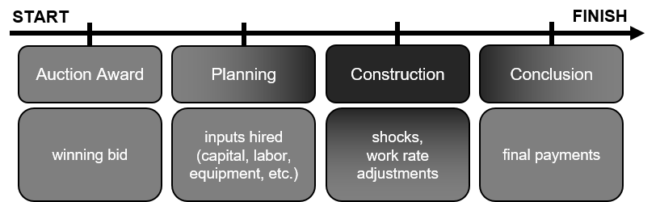
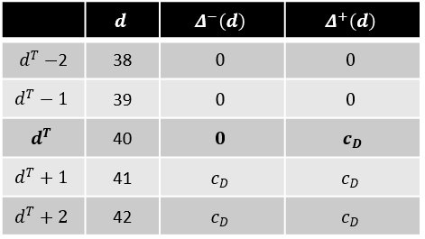
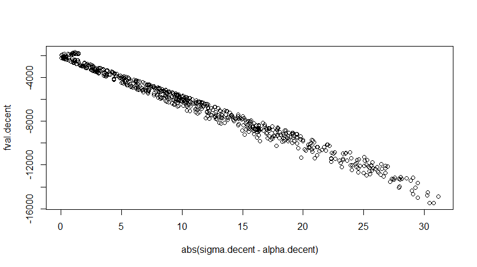
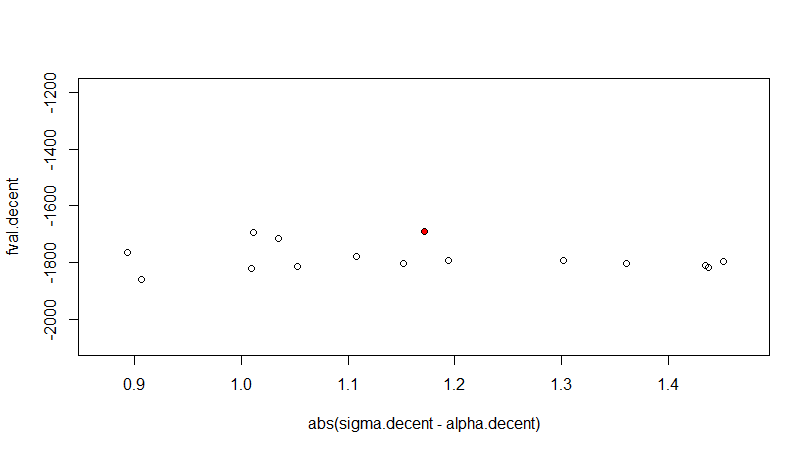
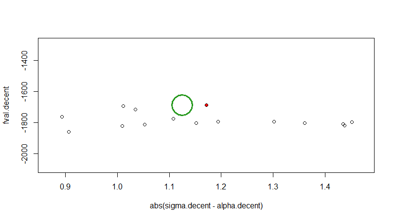
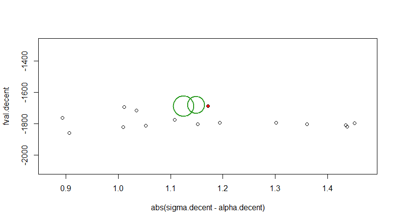
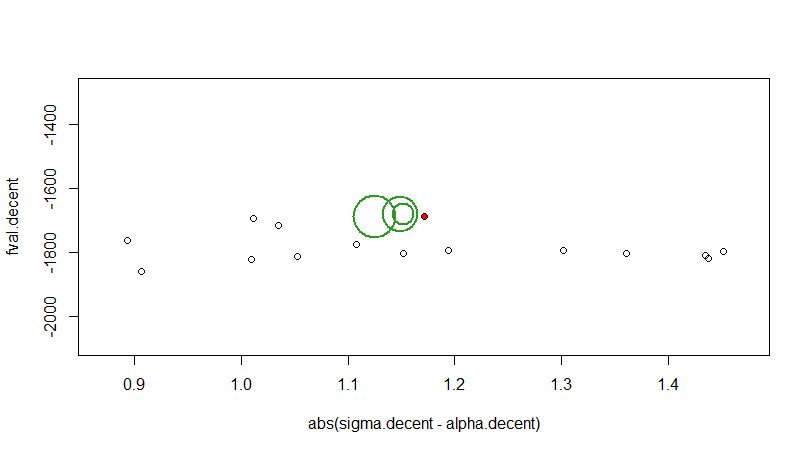
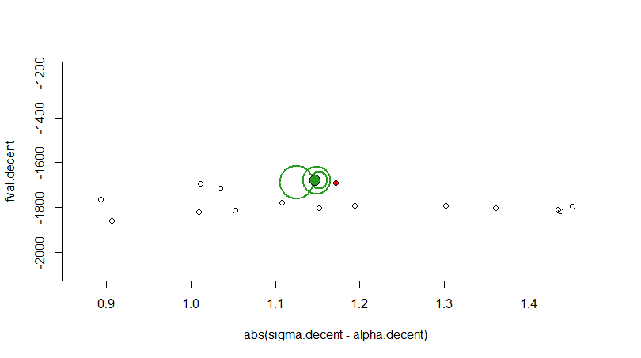

# Incentives and Delay in Public Procurement


```{r 'check_ps', include=FALSE}

user.name = 'Jane Doe' # set to your user name

library(RTutor)
check.problem.set('IncentiveContracts', ps.dir, ps.file, user.name=user.name, reset=FALSE)

# Run the Addin 'Check Problemset' to save and check your solution
```

**| An interactive Analysis in R**

Author: Claudius Schmid (2018)


<style>
img {
    display: block;
    margin-left: auto;
    margin-right: auto;
    max-width: 100%;
}
</style>

Welcome! This is a RTutor Problem Set, containing the main results from the paper **"Moral Hazard, Incentive Contracts and Risk: Evidence from Procurement"** from Patrick Bajari (University of Washington and NBER) and Gregory Lewis (Harvard University and NBER) published in 2013. If you are interested in the paper, you can download it from <a href="https://academic.oup.com/restud/article-abstract/81/3/1201/1602080?redirectedFrom=fulltext" target = "_blank"> academic.oup.com </a>. I will use the abbreviation BL to refer to this paper during the Problem Set. Besides the paper, you can also get access to the data from <a href="https://www.nber.org/data-appendix/w17647/" target = "_blank"> nber.org </a> (including data sets and Matlab/Stata functions), which the authors used to get to their results.


## Exercise Set Up

Introduction

1. Overview - Starting with R

2. Theoretical Model

3. Descriptive Analysis

4. Formal Analysis

5. Estimation

    5.1 Performing the Implementation 
  
    5.2 Results and Fit of the Model

6. Analyzing Strategies - Policy Changes

Conclusion

Appendix

References


Presenting the main results from this paper and constructing this Problem Set is the main part of my master thesis in 'Wirtschaftsmathematik' (mathematics and management) at the University of Ulm. I recommend to do the exercises one after the other, but it is also possible to choose the exercises freely. However, there are several ways to do work on this Problem Set. Check out my Github (<a href="https://github.com/ClaMaSch/RTutorIncentiveContracts" target = "_blank"> github.com/ClaMaSch </a>) account to get more information. There is also the possibility to solve this Problem Set on <a href="https://shiny.rstudio.com/" target = "_blank"> Shiny.rstudio.com </a>.


## Exercise Introduction

*Incentive contracts should be used to motivate contractors to earn more by achieving better performance and controlling costs. When you build a foundation in incentive contracts, you will be able to better drive performance and cost efficiency. You will study the basic principles of profit incentives, considerations in contract type selection, elements of incentive contracts, and the relationship between incentive contracts and government pricing policies.*

[Management Concepts, 2018]

Road construction projects are largely known to everyone. Everyone has been affected by the impact of such projects. The first thing, which comes to one's mind when thinking about road construction, is the negative impact on one's own travel time. Nobody likes to get stuck in traffic jams or to suffer from long delays on the way to work. 

How long a road construction project lasts depends strongly on how the contract between the purchaser and the contractor is structured. In order to keep the negative effects for commuters at a minimum, it is highly advisable to define a completion date. The contract for a road construction project is normally awarded to contractors at auctions. Incentives must be set in the contract to ensure that the company awarded the contract for a road construction project meets its contractually agreed completion date.

In this RTutor Problem Set we examine so-called standard contracts. In these contracts, incentives are generated in the form of a contractually agreed completion date and time penalties for late project completion. Bajari et. al. (2013) (BL) collected contract data from 466 road construction projects in Minnesota (USA) and compiled it into a data set.

We investigate to what extent these specified completion times have an influence on the work rates of the companies. Here BL assume that the work rate is not contractually fixed and that it is therefore possible to adapt the work rate in the course of the project. The companies plan their projects initially under all the factors they can observe or predict (e.g. capital, labor). In addition, there are unforeseeable shocks in the course of the project (e.g. delays in material deliveries, bad weather conditions, breakdown of machines). Both these predictable and unforeseeable factors influence the completion time. By an increase of the work council, after a bad shock, a project can back on track again in terms of the schedule. That, however, is related with additional costs and therefore an incentive must be created here.

BL estimate these unpredictable shocks using OLS. They use various contract parameters from the data set (such as the planned work rate, historical weather data, etc.) to linearly approximate the hours required for project completion. Indeed, we find evidence that firms are adjusting their work rates in terms of time incentives and shocks. In addition, we will see that the probability of a project is being delayed decreases when higher time incentives are created.

Since the ongoing construction of the road has a negative impact on commuters, it is interesting from a social point of view to induce companies to impose time penalties equal to the costs incurred by users. For this purpose, we will explicitly estimate user costs (traffic delay costs), e.g. on the basis of alternative routes to be used. These user costs are investigated by means of so-called lane rental contracts. This type of contract has no explicitly defined completion time.  Here the incentive for the companies is created by a daily Lane Rental to be paid (from the beginning) in the amount of these user costs.

We will derive in detail how BL estimate the marginal benefit of delay function of the companies in order to investigate alternative contract strategies with the help of this function. One of these contract strategies examines a 10% lane rental policy. Here, time incentives are set at 10% of traffic delay costs, resulting in an enormous increase in welfare compared to the use of standard contracts. This welfare increase corresponds to more than 20% of the average order volume.

The Problem Set at hand is set up in exercises and has the following structure. First, we will have a look at the data, which include characteristics (parameters) from highway construction contracts in Minnesota. To handle the data, we will get to know some interesting and useful applications and functions in R. After that we explore a theoretical model, which implies theoretical predictions and we will try to find evidence for these predictions by using the real data. To do so we start with a graphical view on the predictions (like the work rate adjustment) and afterwards we go on with a much more formal approach, using OLS to find evidence for these predictions. After the descriptive analysis we will estimate the marginal benefit of delay function of the contractors of these highway projects. We will use this estimated function to analyze alternative contract strategies. 


## Exercise 1 -- Overview  - Starting with R

We will consider contracts from state highway construction projects in Minnesota. Such contracts are normally awarded during an auction. In this problem set we are interested in how time incentives, laid down in the contract, affect the contractors choice of working on a project after the contract was awarded to a contractor (company). The time incentives are implemented by means of penalty payments for ongoing construction.





We focus on the construction phase (Fig.1) of a project, using input parameters (contract characteristics) from the planning phase and additional information during the construction phase (e.g. weather conditions). BL collected a sample of contracts with several contracts characteristics. It is obvious that a project should not take too much time, as ongoing construction delays commuters. So the contract completion time is one of the most important contract parameters. Completion time depends on factors under the contractor's control (e.g. inputs and work rate) as well as on unexpected shocks (e.g. bad weather and equipment failure). These shocks may affect the amount of hours a company has to work on a project.

We will learn more about the contractor's choice of work rates and completion times, when we have a look on the contractor's cost function, depending on labor and capital costs and on additional time incentives. These time incentives are generally generated by penalty costs for ongoing construction. We will analyze in detail the interaction between labor, capital and penalty costs in the course of the next exercises. But first, let's have a look on a data set that includes contract parameters from 466 highway construction projects.

The main data, which is used during this Problem Set is named `contracts.dta`. The ending `.dta` is a stata file ending. Let's read in our first data set with the function `read.dta13()` from the `readstata13` package.

info("read.dta13()") # Run this line (Strg-Enter) to show info

We will interactively get a look on the contracts. For solving the upcoming tasks you can always have a look on relevant info blocks, like the info block above. If you have any problems solving a task, you can always press the hint button to get additional information. If you are not able to solve a task you may press the `solution` button. Often there will be given some parts of the solution. In these cases you have to complete the solution by replacing the dots. If there are such partial solutions, don't forget to uncomment given lines. There will also be some chunks where you only have to press the `check` button.

**Task:** Please read the data set `contracts.dta` (it is stored in the current folder). We want to use the data set as a data frame named `contracts`. Since this is your first task, the solution is almost entirely given. You just have to replace the dots with the right names and then press the `check` button. Again, don't forget to uncomment the given line.

```{r "1__3"}
# ... = read.dta13("...")
contracts = read.dta13("contracts.dta")
```


Before we get a deeper look inside the data and specific parameter columns, let's have a short look on the entire data.

**Task:** Use the R basic function `head()` to show the first rows of the data set `contracts`. Evaluate your solution by pressing the `check` button.

```{r "1__4"}
# head(...)
head(contracts)
```

As far as you read in a data set, you can press the `data` button to get to the ``Data Explorer`` tab. Here you get more information about the column names and their description. You can also *play* with some plots by defining an independent and a dependent variable  (here: column vectors). To come back to the exercises, just select the tab number of the current exercise (now tab 1).

Just have a first look on the data and get an idea about the contracts. Each row includes a contract, specified by its `contractID`. The column `contrval` is the contract value and represents the winning bid of the contractor. There are several hourly and daily parameters and some firm, contractor or rather location specific characteristics we will get to know later.

Let's define a sub sample of the contracts. The sub sample should be named `contracts2005` and should include only the contracts, which were awarded in 2005. To define the sub sample, you can use the `filter()` function from the `dplyr` package.

info("filter()") # Run this line (Strg-Enter) to show info

**Task:** Filter the main data `contracts` by using the `filter()` function with the command `year == 2005` to get the sample data set `contracts2005`. When you think your answer is correct, press the `check` button.

```{r "1__7"}
# ... = filter(...)
contracts2005 = filter(contracts, year == 2005)
```

Now also this data set is inserted in to this exercise. Another interesting and helpful function contained in the `dplyr` package is the `select()` function.

info("select()") # Run this line (Strg-Enter) to show info

**Task:** Show all contracts from 2005, but constrain on the contracts name `contractID`, the contract value `contrval` and the amount of hours planned by the engineers `planned_hours`. Please uncomment the line and replace the dots with your solution. You can press the `run chuck` button to get a look on your current output. When you trust your solution press the `check` button.

```{r "1__9"}
# select(...)
select(contracts2005,contractID,contrval,planned_hours)
```

<br>


Quiz: What is the name of the contract, in the 2005 sample, which has the highest contract value? Use the table above to answer this question.

- S05088 [ ]

- M05117 [ ]

- D05124 [ ]

- S05186 [x]


<br>

Another important contract characteristic is, whether the contract ended late. Since therefore penalty payments can be charged. Let's check the outcome for the above mentioned contract. We can answer this question by taking a look on the difference between the `planned_days` and the `actual_days` or the difference between the `planned_hours` and the `actual_hours`. For sure we can also compare the hourly work rates. The `planned_workrate` and the `actual_workrate` are just calculations as you can see in the info block below.

info("Work rate calculation") # Run this line (Strg-Enter) to show info

**Task:** Find out whether the contract "S05186" is late. Use the following chunk to enter your commands and press `run chunk` to run your current code. There are several ways to find out if the contract "S05186" is late. Press the `hint` button to get a first idea. Finally you should press the `solution` and afterwards the `check` button.

```{r "1__10",optional=TRUE}
# select(filter(...),...)
select(filter(contracts2005,contractID=="S05186"),contractID,planned_days,actual_days,planned_hours,actual_hours,planned_workrate,actual_workrate)
```

<br>


Quiz: Is the contract "S05186" late ?

- Yes [x]

- No [ ]


<br>

For each contract, this characterization is stored in the binary variable `late`. The actual work rate has elemental influence on the variable `late`. When the workers work less hours per day than they are supposed to, this might be one reason why a project ends up late. Let's have a look on the distribution of the `actual_workrate`.

**Task:** Plot a histogram of the `actual_workrate`. As the 2005 sub sample would be not very descriptive (includes only 20 contracts), use the main data set `contracts`. Use the R basic function `hist()`.

```{r "1__11"}
# hist(...)
hist(contracts$actual_workrate)
```

The basic R function `hist()` depicts rather unimposing plots. The function `ggplot()` from the `ggplot2` package is much more graphically motivated. A possibility to depict the histogram (including the density) above with `ggplot()` you can see in the following info block.

info("ggplot()") # Run this line (Strg-Enter) to show info

We see the actual work rate is *almost normally distributed* with an average working day of about nine hours per day.

Since we will use regressions in the later analysis exercises, let's do a short linear regression at this point.
To do so, we want to answer the following question. If the engineers planned more days, is the actual amount of days (positively) correlated with the planned amount of days?

To get a first graphical idea, we want to have a look on the scatter plot of these two variables.

**Task:** Depict a scatter plot by using the R basic function `plot()` (later we will also see scatter plots using `ggplot()`). Use the `planned_days` on x-axis (explanatory variable) and the `actual_days` on the y-axis respectively.

```{r "1__13"}
# plot(...)
plot(contracts$planned_days,contracts$actual_days)
```

This scatter plot may lead to a positive correlation between the two variables. Now we do a linear regression (OLS) using the `lm()` function.

info("Linear regression with lm()") # Run this line (Strg-Enter) to show info

**Task:** Regress the `actual_days` on the `planned_days` using `lm()`. Store the regression into a variable named `reg`. Just uncomment the second line, so you get the summary statistics of this OLS.

```{r "1__15"}
# reg = lm(... ~ ...,data = contracts)
# summary(reg)
reg = lm(actual_days ~ planned_days, data = contracts)
summary(reg)
```

Indeed the p-value is smaller than any reasonable significance level ($0$% significant level here). So we can say, if a engineer plans more days for a project, then indeed the project will take longer. This result might be intuitive but that is good. With this simple and intuitive example we see how to use regressions and possibly find linear dependencies between variables.

We use `ggplot()` to get a nicer look on the results. Just press the `check` button. The plot shows the regression results graphically. We see the scatter plot and the regression line. The increasing regression line shows the positive correlation between the two variables.

```{r "1__16"}
ggplot(contracts, aes(x = planned_days,y = actual_days)) + 
  geom_point(alpha = 0.3) + 
  geom_smooth(method = "lm", formula = y ~ poly(x,1),se = FALSE) + 
  labs(title="OLS",x="planned days", y = "actual days")
```


Let's go on with a theoretical model in exercise 2.


## Exercise 2 -- Theoretical model

We have taken a first look at a few contract parameters, we would like to describe a theoretical model. The contractors have private costs based on contract parameters (such as capital, personnel employed, number of hours per day worked, etc.). These are parameters that can be planned in advance. In addition, unexpected events (so-called productivity shocks) can occur. These shocks can be both positive (if it runs better than planned) and negative (if it runs worse than planned) and must be considered in the calculation of contractor costs.

If a road has to be closed due to construction work, then those who use the road are the ones who suffer (commuters, users). For this reason, a road construction project should certainly only take the most necessary amount of time.  This in turn means that companies should generally hurry so that commuters do not have to be affected by delays (due to construction) for too long. The companies can achieve faster finalization either through more capital and labor, or through a higher work rate. BL assume here that the capital and work volume is contractually fixed at the start of the project and that only the work rate (which is not contractually fixed) can be changed in the course of the project. This means that if an unexpected productivity shock occurs, the companies will only be able to return to the original schedule through a higher (or lower) work rate.

Now let's define the variables of a two-period model, designed by BL. As already mentioned, the contractor first chooses a fixed capital of $K$ (for equipment, project manager, etc.). The worker volume $L$ is also fixed. During the construction phase a productivity shock $\theta$ is observed. Such a shock is unknown in advance (ex-ante) and affects the required number of hours. This contains everything unexpected that the company cannot include in the planning of the project. Although the contractor generally includes historical weather data, for example, in the planning of the hours, it is possible that the weather may be above-average good or bad. Such unexpected circumstances are reflected in this productivity shock. So we can define the amount of hours to complete a project by $H(K,L,\theta) =:H$.

In the second period, the contractor makes a choice about the number of hours to work on a day. We relate this work rate (in hours per day) to the variable $s$. The days the project takes can be derived from this. A project needs $d=H(K,L,\theta)/sL$ days to be completed. We are following BL that the work rate does not affect the total work to be done, but the work rate is influenced by the **time incentives** laid out in the contract.

BL consider **standard contracts**. In these contracts, time incentives are characterized and implemented as follows: Each contract consists of a target date $d^T$ at which the contract must be completed. If this time is exceeded, the contractor has to pay a penalty payment of $c_D$ (delay cost, time penalties) for each day after this target date. Besides these delay costs the contractor has capital and labor costs. The contractor is risk-neutral and pays a daily rental rate of $r$ per unit capital and an hourly wage of $w(s) = \bar{w} + \tau s$, a fixed wage $\bar{w}$ and a benefit share $\tau > 0$ from the work rate $s$.

This leads to the ex-post private costs for the contractor (standard contract design):

$$\begin{aligned}
C_s(s,K,L,\theta) &= \underbrace{H(K,L,\theta)(\bar{w}+\tau s)}_{\text{labor costs}} + \underbrace{rK\dfrac{H(K,L,\theta)}{sL}}_{\text{capital costs}} + \underbrace{\textit{max}\left\{ \dfrac{H(K,L,\theta)}{sL}-d^T,0\right\} c_D}_{\text{delay costs}} & & \text{(1)}
\end{aligned}$$

Since $s = H/dL$ and so $d= H/sL$ we can rewrite the hourly wage function (now depending on $H$ and $d$) to $w(H,d) = \bar{w} + \tau H/dL$. This leads to the cost function depending on $d$:

$$\begin{aligned}
C_d(d,K,L,\theta) &= \underbrace{H(K,L,\theta)(\bar{w}+\tau \dfrac{H(K,L,\theta)}{dL})}_{\text{labor costs}} + \underbrace{r K d}_{\text{capital costs}} + \underbrace{\textit{max}\left\{ d-d^T,0\right\} c_D}_{\text{delay costs}} & & \text{(2)}
\end{aligned}$$

So there are three individual costs to be considered. At first we focus on the delay costs, which depend on the penalty payments $c_D$ for each day late, and how BL got to this payment information for each observed contract.


### Time Incentives and Theory Predictions

The specific time penalties $c_D$ which have to be paid for each day late can be derived from the table you will read in the next task. The penalties were last increased in 2005 and BL got their information from the *Minnesota Department of Transportation* (Mn/DOT). The table which includes the penalty data is stored in a file in the current folder and is named `timepenalties.dta`.

**Task:** Read in the file `timepenalties.dta` using the function `read.dta13()` as you did in the first exercise. Store the data into the variable `timepenalties`. Press `edit` at first, so you can replace the dots with your commands and afterwards press the `check` button.

```{r "2"}
# ... = read.dta13("...")
timepenalties = read.dta13("timepenalties.dta")
```

The table is now imported. To get a nice look on it, we use the function `stargazer()` from the `stargazer` package.

info("stargazer()") # Run this line (Strg-Enter) to show info

**Task:** Replace the dots with the name of the data frame, which you just imported. Since we want to see the data frame itself, we set the option to `summary=FALSE`.

```{r "2__4"}
# stargazer( ... ,type = "text",summary = FALSE)
stargazer(timepenalties,type = "text",summary = FALSE)
```

As mentioned before, the main data set `contracts` includes 466 contracts. These project contracts were awarded between 1996 to 2005. As we see in the `timepenalties` data, the time penalty $c_D$ for a contract depends on its monetary amount and the year in which the contract was awarded.


Quiz: For example, if an arbitrary contract from 2000 has an amount of 750.000 dollars, what would be its time penalty for each day late? (Note that the contract value bins interpret less or equal bins to the next smaller bin).

- $ 500 [ ]

- $ 750 [x]

- $ 1000 [ ]

- $ 1250 [ ]


<br>

For every contract, this calculation is referred to the variable `penalty` in the `contracts` data set. Later you may get access to the time penalties using the command `contracts$penalty`.

We already know that the number of days $d$ is dependent on the work rate $s$. Since the work rate will be influenced by the time penalties, we are now going to investigate the completion time. As we will see, this results in an interesting theory prediction.

#### Completion time analysis

Let's have again a look on the cost function $(2)$, depending on $d$. We separate the time incentives (delay costs) from the other costs (labor and capital) to see how much money the contractor can save by working more slowly and completing the project one day later.

Ignoring the penalty costs, the costs of completing in $d$ days for a given $K$ and $L$ is

$$\begin{aligned}
c(d,\theta) = H(K,L,\theta) \left( \bar{w} + \tau \dfrac{H(K,L,\theta)}{dL})\right) +rKd & & \qquad \text{(3)}
\end{aligned}$$
Taking the derivation of $c(d,\theta)$ leads to

$$c'(d,\theta) = - \dfrac{\tau H^2}{d^2L} + rK$$
Lets interpret this. The derivation $c'(d,\theta)$ is the monetary cost amount (marginal costs for labor and capital), which has to be paid for completing the contract one day later. Multiplying this by minus one leads to the marginal benefit for completing one day later $-c'(d,\theta) =: b'(d,\theta)$. We refer the following to the **marginal benefit of delay function**:

$$\begin{aligned}
b'(d,\theta) = \dfrac{\tau H^2}{d^2L} - rK& & \qquad \text{(4)}
\end{aligned}$$
Thus, waiting one day leads to a benefit from the labor costs, but we have to pay capital costs for one more day. Note the marginal benefit of delay function is strictly decreasing in $d$.

We can interpret $(3)$ as a contract design with no payments for ongoing construction. The companies would minimize its costs by taking the first order condition in either $(3)$ or $(4)$, meaning they would complete at $d^*$ solving

$$\dfrac{\tau H^2}{d^2L} - rK \stackrel{!}{=} 0$$

Theoretically we know the form of the marginal benefit function so let's evaluate this function for arbitrary theoretical values. Let's assume, an engineer plans $H = 15.000$ hours for a project and the engineer can draw from a crew of $L = 20$ workers. Finally we assume that the project engineer plans a capital amount of $K = 10.000$ dollars a day, the capital cost rate is $5$% and each worker gets an wage increment of $\tau = 1$ of the work rate.

The following chunk plots the marginal benefit of delay function for these arbitrary values. The example values are already included so you just have to press the `check` button.

```{r "2__5"}
H = 15000
r = 0.05
K = 10000
L = 20
tau = 1

# intersection (d_opti,0)
d_opti = sqrt(tau*H^2/(r*K*L))
d_opti
d = seq(1,2*d_opti)

# marginal benefit of delay function
b = (tau*H^2)/(L*d^2) - r*K

# data frame for ggplot
df = data.frame(d,b)

# plot marginal benefit of delay function, the x-axis and the intersection
ggplot(df,aes(x=d)) + 
  geom_line(aes(y=b),colour = "#327183",lwd=1) +
  geom_point(aes(x=d_opti,y=0),size = 2.5,color = "black") +
  annotate("text", label = "d*", x = d_opti, y = -1.25*abs(min(b)), size = 4,
           colour = "black") +
  annotate("text", label = "x-axis", x = 1.9*d_opti, y = 0, size = 4,
           colour = "black") +
  ylim(-2.5*abs(min(b)),10*abs(min(b))) + 
  theme(#axis.text.y=element_blank(),
        #axis.ticks.y=element_blank(),
        axis.text.x=element_blank(),
        axis.ticks.x=element_blank())+
  ggtitle("Contract design without (penalty) payments")+
  xlab("Days d") + ylab("Marginal Benefit of Delay b'(d)")
```

You can see the intersection between the marginal benefit of delay function (blue function) and the x-axis. For this example contract, determine the amount of days $d^*$ the firm would optimally choose - in theory.

**Task:** Calculate the optimal amount of days $d^*$ for this contract design without penalty payments. You can run your calculations with the `run chunk` button. If you think your solution is correct you can try to answer the following question.

```{r "2__6",optional=TRUE}
# You can enter your commands here
d_opti = sqrt(tau*H^2/(r*K*L))
d_opti
```

<br>


Quiz: How many days will the contractor optimally choose?

- 50 [ ]

- 100 [ ]

- 150 [x]

- 200 [ ]


<br>

Within this Problem Set, we will mainly investigate *standard contracts* since the `contracts` data set is completely based on these contracts. However we also investigate *lane rental contracts* in the counterfactual part later. With these contracts the contractor pays both labor as well as capital costs and has to pay a daily lane rental (which is the time incentive in these contracts). We can interpret this as a special case with a deadline of $d^T = 0$ and a lane rental rate payment of $c_D$.

Both contract scenarios are depicted in the following graphic. Just press the `check` button to see the graphic. Therefore I wrote the function `contract.design()` which generates the plot. If you are interested in the function call, you can take a look at the info block below and you also find the function in the appendix.

```{r "2__7"}
H = 15000
r = 0.05
K = 10000
tau = 1
L = 20
cD = 1500
dT = 100

minus = 0.5
plus = 2

contract.designs(H,r,K,tau,L,cD,dT,minus,plus)
```

info("Contract Design Plot") # Run this line (Strg-Enter) to show info

The penalty payments are assumed to be $c_D=1500$ dollars. The values for the middle function (blue) are the same as in the scenario above with *no penalty payments*. Additionally you see the marginal benefit of delay functions for a good (half hours are needed) and a bad (double hours are needed) productivity shock. Therefore the variables `minus` and `plus` define productivity shock factors and influence the amount of the hours `H` to complete the project. Keep in mind, that these are theoretical values and that each variable has its influence on the outcome. So at this point it should only be a graphical approach of getting an idea of the marginal benefit and the time penalties. You can see the profit maximization graphically for each contract design with the same marginal benefit functions for three different productivity shocks.

For the lane rental design on the left panel, the contractor faces penalty payments of $c_D$ from the beginning on and so the contractors benefit maximization (equating the marginal costs of delay (which are the time penalties $c_D$) with the marginal benefit of delay) implies that for each shock $i$ ($i \in$ $\{\text{good,average,bad}\}$) the contractor finishes the project at $d^*_{(i)}$.

On the right panel you see the same functions under the standard contract design. Here the marginal delay costs (time penalties) are zero as long as the target date isn't reached. But after the target date $d^T$ each additional day is penalized by $c_D$ and that is the reason why the time penalties jump discontinuously up from zero to $c_D$. This will lead to a first theoretical prediction.

Exploit the advantage of the function `contracts.designs()`. You can use it dynamically, which means you can see the outcome for other shocks by changing the `minus` and the `plus` shock factors. I initially chose the half (`minus` $= 0.5$) and the double (`plus` $= 2$) approach to depict an extreme scenario. It definitely won't be the general case that a project needs half or double time, respectively. Besides, that would mean a bad planning in advance. So try to see the outcome for values which are much more realistic, e.g. $15$% less and $15$% more hours needed than expected.

**Task:** First uncomment the given lines, change the `minus` and the `plus` value in order to see the outcome with $10$% less and $10$% more hours than expected and finally press `check`. The other variables are still stored in the background. After you had another look on the newly generated graphic, you should be able to answer the following question correctly.

```{r "2__9"}
#minus = ...
#plus = ...
#contract.designs(H,r,K,tau,L,cD,dT,minus,plus)
minus = 0.85
plus = 1.15
contract.designs(H,r,K,tau,L,cD,dT,minus,plus)
```


Quiz: If you use much more realistic shock factors, which consequence does it have on the outcome of a standard contract designed project?

- no completion time changes [ ]

- less hourly variance strictly implies an earlier contract completion time [ ]

- bundling of completion time [x]


<br>

Much more realistically selected productivity shocks lead to complete a standard contract on time ($d^* = d^T$). That means we should theoretically see a bundling of contracts in the data set, which finish at, or at least around, the target day. That is the first theory prediction for which we will try to find evidence in the data set.


#### Work rate adaption

Another theory prediction results from analyzing the optimal work rate. Since the work rate is not contracted, the contractor can change the work rate during the construction period. Let's have a look on how the work rate should be optimally chosen, when all other (fixed) parameters are given. To do so, we have to take the first order condition in $s$ regarding to $(1)$. Note that we will focus on the standard contracts. We will come back to the lane rental design in the counterfactual exercise later.

Recall the contractors cost function $(1)$, depending on $s$:

$$C(s,K,L,\theta) = H(K,L,\theta)(\bar{w} + \tau s) + rK\dfrac{H(K,L,\theta)}{sL} + max\left\{\dfrac{H(K,L,\theta)}{sL} - d^T,0\right\} c_D$$

Define $\bar{s} = H/(d^TL)$ as the (ex-post) work rate required for on-time completion. There exist two cases, depending on whether the delay costs are zero ($d < d^T$ $\Leftrightarrow$ $s > \bar{s}$) or positive ($d>d^T$ $\Leftrightarrow$ $s < \bar{s}$).

1.) $s > \bar{s}$

$$\begin{eqnarray}
\dfrac{\partial}{\partial s} C(s,K,L,\theta) & = & H\tau - \dfrac{rKHL}{s^2L^2} \stackrel{!}{=} 0\\\\
& \Leftrightarrow & s^* = \sqrt{\dfrac{rK}{\tau L}}
\end{eqnarray}$$

2.) $s < \bar{s}$ 

$$\begin{eqnarray}
\dfrac{\partial}{\partial s} C(s,K,L,\theta) &=& H\tau - \dfrac{rKHL}{s^2L^2} - \dfrac{c_DHL}{s^2L^2} \stackrel{!}{=} 0\\\\
&\Leftrightarrow& s^* = \sqrt{\dfrac{rK+c_D}{\tau L}}
\end{eqnarray}$$

Note that we only consider positive work rates here. If $s>\bar{s}$ applies, then the project was unexpectedly easy to complete (i.e. the company was exposed to good productivity shocks). According to this, the company could have worked slower and would still have finished on time. However, slower work implies that more capital costs have to be paid, faster work on the other hand increases labor costs. To handle these costs optimally means that the contractor chooses exactly $s^*=\sqrt{rK/\tau L}$ in this case. And this in turn leads to earlier project completion. If, on the other hand, the company is exposed to poor productivity shocks and thus to the situation that the project will take longer than expected, the company optimally choose $s^*=\sqrt{(rK+c_D)/\tau L}$ and thus finish the project late. If the project runs as expected, the company chooses $s^*=\bar{s}$ and finishes the project on-time.

From this we can define the next theoretical prediction: Does the work rate increase when the productivity shock increases? This question is also addressed in the next two exercises.

However, there is also a limitation to the adjustment of the work rate. No (good) productivity shock can cause a company to work slower than $\sqrt{rK/\tau L}$. Conversely, there is no (bad) productivity shock that would cause a faster work rate than $\sqrt{(rK+c_D)/\tau L}$. This means that within the limits $[\sqrt{\dfrac{rK}{\tau L}},\sqrt{\dfrac{rK+c_D}{\tau L}}]$ the company can arbitrarily adjust its work rate (for fixed labor and capital).

Finally, we have thus made two interesting theoretical predictions. First, the theory predicts **many projects to be completed on-time** and second, it is predicted that companies **adjust their work rates to respond to productivity shocks**. The latter also means that the work rate for early projects (early caused by good productivity draws) should be averagely less than that for on-time projects and that again less than that for delayed projects.


## Exercise 3 -- Descriptive Analysis

We have seen interesting predictions from the theoretical model, which we now want to verify by using the real project data. BL got their set of highway construction contracts from the *(Mn/DOT)* and prepared a sample of 466 contracts including over 30 contract parameters. We will use their main project characteristics in order to find evidence for the theory predictions.

**Task:** Since this is the beginning of a new exercise, we have to input the `contracts` data set again. Press the `edit` and the `check` button afterwards to do so. (We have to re-read the data in each exercise).

```{r "3"}
contracts = read.dta13("contracts.dta")
```

To get an overview of the data, we want to depict the mean, the standard deviation, the minimum and the maximum of each contract parameter. Therefore we use the `stargazer()` function from the first exercise.

**Task:** Replace the dots with the name of the main data set to get a look at the parameter statistics. Do not forget to uncomment the given line.

```{r "3__2"}
# stargazer(...,type = "text")
stargazer(contracts,type = "text")
```

An average project plans about $37$ days till completion (`planned_days`), which is the analog of $d^T$ in the theory part. A contractor works about $356$ hours for a project (the analog of $H/L$ in the theory, because the several total man-hours $H$ and the size of the work crew $L$ are unobserved). The work rate (`actual_workrate`, analog of $s$) is in average around $9.3$ hours and that is almost identical to the (average) planned engineer work rate (`planned_workrate`). We also know the variable `penalty` from the last exercise. These are the time penalties depending on the `year` and the contract value `contrval`. The latter is in general about \$$1.2$ million dollars.

The variables which include `_norm` are already normalized variables. We will use such a normalization (dividing variables by the `planned_days`) to make comparison across the different contracts possible (e.g. `dw_norm`, `hw_norm`, `penalty_norm`).

Another important variable is the `enforcement` of the penalties. Generally a project, which exceeds the target day, should be penalized by the delay costs. As you can see in the summary statistics, we only have information about the enforcement of the penalty payments, if the contract was late and therefore some projects were penalized and others were not.


Quiz: Can you derive by now, how many contracts in the data set are late?

- 87 [ ]

- 153 [x]

- 466 [ ]


<br>

There are several other contract parameters, e.g. the last nine variables in the table above (e.g. `rain`, `snow`). These variables will be included as explanatory variables into some OLS later and therefore explained in the appropriate place.

The `usercost` (traffic delay costs) will be important in the last exercise when we try some other contract strategies for a sub sample of the contracts and therefore we also use the variable `insample_predict`, which includes the probabilities that the contract is in or out of this sub sample, regarding to its parameters. That was too fast? Do not worry, we will discuss this in detail later.

You can always have a look at the appendix or the `Data Explorer` to get information about the variables.

### Graphical analysis of the theoretical predictions

We found two theoretical predictions in the former exercise. Now we want to get an initial empirical look at these predictions by using the (standard) contracts data. At first we focus on an (informal) graphical analysis here - a kind of empirical counterpart to the theory - before we go on with the formal analysis of the predictions in the next exercise.

#### Completion time analysis

We are now familiar with the contract parameters and so we want to have a look at the first prediction. The theory predicts, that there should be a lot of on-time contracts, when the contracts are designed as *standard contracts*.

First, we have to declare a new variable called `days.late`. This variable should define the daily distance between the total days actually worked (`actual_days`) and the days initially planned by the engineers (`planned_days`). After this declaration we want to show the fraction of observables in a histogram.

**Task:** Define the variable `days.late`, then edit the second code line and write in the right variable into the `hist()` function. (Do not care about the options in the `hist()` function. These just make the plot look neater).

```{r "3__3"}
# ... = contracts$actual_days - ...
# hist( ... ,xlim = c(-20,20),breaks = 300,freq = F,xlab = "Days Late",density=50)
days.late = contracts$actual_days - contracts$planned_days
hist(days.late,xlim = c(-20,20),breaks = 300,freq = F,xlab = "Days Late",density=50)
```

Indeed, there is a bundling of completion time around the deadline. A full $11$% of contracts finish exactly on time and thus correspond to zero days late. In the later analysis (Exercise 5 and 6) we will say a contract is on-time, if $d \in (d^T-1,d^T]$. In other words: The contract finishes on-time, if the contractor works and finishes on the target day $d^T$ (therefore the vector `outcome2` is defined in the data set - you can get further information about the outcome vector in the appendix). In terms of the histogram, this corresponds to the highest bar in the middle and increases the amount of on-time contracts to about $20$%. So graphically, we indeed can confirm the first theory prediction of many on-time contracts through the bundle of completion time on the target day.

#### Work rate adaption

In theory, the work rate should be lowest on average in contracts that finish early, higher for on-time contracts and still higher in contracts that finish late. Lets try to see this effect graphically. The analysis of the work rate adaption will lead us to another interesting fact about the relation between the contract's outcome and the underlying penalties.

As mentioned before, we have to normalize some contract characteristics to make comparison between the contracts possible. The normalized working days (`dw_norm`) are the `actual_days` divided by the `planned_days`. We refer `dw_norm` to $\tilde{d}$. We run a local linear regression of some different outcomes (plotted on the y-axis) on the x-variable $\tilde{d}$. We compare (for some average outcomes) contracts that finished `early`, `ontime` or `late`. We also will see the 95% confidence intervals.

**Task:** At first, please determine the variable `dw_norm`. This should give you the idea of the normalization. Your definition should be the same as the variable in the data set. Therefore the chunk will output the sum of the errors (difference between your solution and the given solution, which should be zero).

```{r "3__4"}
# dw_norm = ...
# sum(dw_norm - contracts$dw_norm)
dw_norm = contracts$actual_days/contracts$planned_days
sum(dw_norm - contracts$dw_norm)
```

Well done. That was just an example on how some contract parameters are normalized by the planned days $d^T$. Later, you do not have to calculate these variables on your own. The variables which we will need are already stored in the data set `contracts` as you can see in the summary table above, or you may have a look at the `Data Explorer` and search for the variables.


Quiz: According to the normalized days, What is the corresponding value for `dw_norm`, if a project finishes exactly at zero days late?

- dw_norm < 0 [ ]

- dw_norm = 0 [ ]

- dw_norm = 1 [x]


<br>

For the further *work rate adaption* analysis we will concentrate on those contracts which finished in the range of $25$% early or $25$% late (i.e. a contract for which the engineers planned 30 days but they finished after about five days is not too interesting right now as this is not the general case). Apart from that, we are grouping on the contracts outcome -  contracts ($\tilde{d}=1$) from those contracts which are early ($\tilde{d}<1$) and late ($\tilde{d}>1$) respectively. Therefore we use the variable `outcome` of the data set, where a contract is defined to be on-time if and only if $\tilde{d}=1$ holds (you can get again further information about the outcome variable in the appendix).

Hopefully you remember the `filter()` function from the `dplyr` package in the first exercise. You can use this function perfectly to get the desired database with the normalized days restrictions.

**Task:** Define a data set `adap.dat`, which includes all contracts that finish between $25$% early or $25$% late.

```{r "3__5"}
# adap.dat = filter( ... ,dw_norm > ... ,dw_norm < ...)
adap.dat = filter(contracts,dw_norm > 0.75,dw_norm < 1.25)
```

Now we want to show the `actual_days` variable on the y-axis. The variable `dw_norm` will be automatically set on the x-axis using the function `graphical.analysis()`.

**Task:** You only have to pass the constraint data set and the variable you want to depict on the y-axis to this function. The output will be the graphic.

```{r "3__6"}
# y.var = adap.dat$...
# y.var.name = "Actual Workrate"
# graphical.analysis(adap.dat,y.var,y.var.name)
y.var = adap.dat$actual_workrate
y.var.name = "Actual Workrate"
plot.analysis(adap.dat,y.var,"Actual Workrate")
```

info("Function generating graphical analysis plots") # Run this line (Strg-Enter) to show info

Here we can see an interesting situation. First of all we find partial support for the theory prediction. Indeed on-time projects have higher average work rates than early contracts. Early contracts are affected by better productivity shocks than on-time projects and this suggests that contractors accelerate their work rate to respond to negative shocks, as in the theory model. But when we look at the graphic, the on-time projects have also a higher work rate than late contracts. The reason is that (almost) on-time projects have different time incentives. The incentive to do not finish late is much higher, as these group of contracts have systematically higher time penalties. Actually we see this in the following graphic.

**Task:** Change the y-variable to the normalized penalties `penalty_norm` to see, which contract outcome has the highest average (normalized) penalties.

```{r "3__8"}
# y.var = adap.dat$...
# y.var.name = "Time Penalties (normalized)"
# graphical.analysis(adap.dat,y.var)
y.var = adap.dat$penalty_norm
y.var.name = "Time Penalties (normalized)"
plot.analysis(adap.dat,y.var,y.var.name)
```

The new graphic shows that the **on-time projects indeed have higher normalized penalties** (in average) than either early or late contracts, so for these projects the contractors had higher incentives to accelerate.

Finally let's generate a last graphic. Here the dependent variable is `hw_norm`. The explanatory variable is still `dw_norm`. The variable `hw_norm` are the normalized hours - that is the equivalent to $\bar{s}$ in the theory part - the (ex-post) work rate for  completion.

**Task:** Just press the `check` button. The variable is already included.

```{r "3__9"}
plot.analysis(adap.dat,adap.dat$hw_norm,"(ex-post) workrate for ontime completion")
```

When the project gets *late* (increasing normalized days), we see an increase of the ex-post work rate for on-time completion. That is exactly what the theory predicts. For positive shocks a contractor needs less hours than expected. So the ex-post work rate for on-time completion $\bar{s} = H/Ld^T$ is lower, meaning the contractor could have worked slower for on-time completion but that was not the case and so the project finished early. On the other hand, bad shocks (more hours needed than expected) lead to late contracts and for average shocks the contractors finish on-time. Look also at the greyish 95% confidence intervals. For late projects, the interval is strictly above an ex-post work rate of eight hours a day and for early projects that is just about the average amount of hours.

In this mainly graphically motivated exercise we had a nice look at the graphical side of the theoretical predictions. Next, we use OLS to check if we can find significant correlations to the predictions.


## Exercise 4 -- Formal Analysis

So far we talked a lot about the productivity shock $\theta$ as well as about its consequence for the total hours needed, the work rate and of course the outcome of a project. Since this kind of shock is unobserved, we will estimate the productivity shocks in this exercise in order to include them into the analysis of the theory predictions - this time with a much more formal approach.


**Task:** Input the `contracts` data set again. Press the `edit` and afterwards the `check` button.

```{r "4"}
contracts = read.dta13("contracts.dta")
```


### Estimation of the productivity shock

In order to be able to check the influence of the productivity shock on the work rate, we have to estimate the shock first. We get the productivity shocks out of a *first-stage* regression and then include them into a work rate regression in a *second-stage* to find evidence of correlation.

Remember that the theoretical man-hours needed $H$ depend on capital $K$, labor $L$ and the productivity shock $\theta$. Since BL had no direct observations for $K$ and $L$, they collected other parameters that can describe the amount of the hours. We follow their definition of $\Omega$ - as the contractor's ex-ante *information set*. This set of information contains characteristics that, according to BL, affect the hours $H$ and are known by the contractor before the construction begins. Let $\tilde{h}$ be the normalized hours (i.e. $\tilde{h}_t=H_t/d^T_t$ for all contracts $t \in \{1,\dots,466\}$). The corresponding variable in the data set is `hw_norm` (the actual hours devided by the planned days).

To bring this idea to a mathematical formula we decompose the normalized total hours $\tilde{h}$ (`hw_norm`) as follows:

$$\begin{eqnarray}
\tilde{h}_t &=& E[h|\Omega_t] + \theta_t\\\\
&=& \bar{x}_t\bar{\beta} + \theta_t
\end{eqnarray}$$

For each project $t \in \{1,\dots,466 \}$, we have contract parameters which we assume to directly influence the amount of hours (e.g. snow and rain fall). All these parameter are in the information set (collection of covariates). All other things which the contractor cannot monitor, but which may have influence on $\tilde{h_t}$ are stored in the shock, or rather error, $\theta_t$.

The collection of covariates $\bar{x_t}$, that is sufficient for the contractor's information set, consists of the following variables:

$$\bar{X}=\left(
\begin{array}{c}
penalty\text{_}norm\\\
planned\text{_}workrate\\\
contrval\text{_}norm\\\
rain\\\
snow\\\
big\text{_}firm\\\
instate\\\
firm\text{_}backlog\text{_}norm\\\
overlap
\end{array}\right)^T$$

If you want to get more detailed information about the covariates you can have a look at the following info block. The most important thing you should know is, that we assume that these covariates directly influence the total (normalized) hours needed. Again, we normalize a variable by the `planned_days` to make comparison across the contracts possible.

info("Contractors Information Set") # Run this line (Strg-Enter) to show info


Quiz: What is the dimension of the covariates matrix X (rows x columns)? (Keep in mind that the matrix is transposed)

- (10 x 153) [ ]

- (466 x 9) [x]

- (153 x 10) [ ]

- (466 x 10) [ ]


<br>

We get the estimate of the productivity shock by regressing $\tilde{h}_t$ on $\bar{x}_t$. We refer the following to the "first-stage-regression":

$$\begin{aligned}
\tilde{h} &= \bar{X}\bar{\beta} + \theta\\\\
\Leftrightarrow \textit{hw_norm} = &\textit{penalty_norm} \cdot \bar{\beta_{1}} + \textit{planned_workrate} \cdot \bar{\beta_{2}} + \textit{contrval_norm} \cdot \bar{\beta_{3}}+\\\\
&\textit{rain} \cdot \bar{\beta_{4}} + \textit{snow} \cdot \bar{\beta_{5}} + \textit{big_firm} \cdot \bar{\beta_{6}} + \textit{instate} \cdot \bar{\beta_{7}}+\\\\
&\textit{firm_backlog_norm} \cdot \bar{\beta_{8}} + \textit{overlap} \cdot \bar{\beta_{9}} + \theta
\end{aligned}$$

where $\theta = (\theta_1,\dots,\theta_{466})^T$. We want to do an OLS regression with some fixed effects (FE). Therefore we use the function `felm()` from the `lfe` package. Regarding to the projects, it is useful to set the `year`, `district` and `primary_activity` variables as fixed effects (FE). You can have a look at the following info block to get more information about `felm()` and the use of fixed effects (especially of those we use).

info("Linear regression with fixed effects (FE)") # Run this line (Strg-Enter) to show info

**Task:** Regress `hw_norm` (dependent variable) on the covariates (independent variables) using `felm()`. We store this OLS into the variable `reg.hours`. As this is your first regression with fixed effects and as there are nine variables to consider, the solution is almost complete. Just uncomment and replace the dots with the still missing variables (note that you also have to include one missing FE).

```{r "4__4"}
# reg.hours = felm(... ~ ... + planned_workrate + contrval_norm + rain + snow + big_firm + instate + firm_backlog_norm + overlap | ... + district + primary_activity,data = contracts)
reg.hours = felm(hw_norm ~ penalty_norm + planned_workrate + contrval_norm + rain + snow + big_firm + instate + firm_backlog_norm + overlap | year + district + primary_activity,data = contracts)
```

As a result of the above linear regression, we get the OLS residuals. This residuals include every influence on the dependent variable (here the normalized hours) which are not observed or rather here not under the contractors control. So we can use this residuals as a productivity shock. A good shock ($<0$) reduces the amount of hours and a bad shock ($>0$) increases that amount.

**Task:** Estimate the productivity shock $\hat{\theta}$ as the residuals from the `reg.hours` regression. The productivity shock should be stored into the variable `shock`.

```{r "4__5"}
# ... = residuals(...)
shock = residuals(reg.hours)
```

### Workrate Adaption

Let's come back to the theory predictions. To see, if the work rate (`actual_workrate`) is really influenced by the productivity shock, we want to regress the `actual_workrate` both on the `shock` $\hat{\theta}$ and the covariates $\bar{X}$.

To do so, we use the estimated shock as an additional covariate. This defines the matrix $X$ which includes the covariates from $\bar{X}$ and the estimated productivity shock $\theta$:

$$s_t = x_t\delta + u_t$$

**Task:** The following regression almost works as the regression `reg.hours`. You just have to change the dependent variable to the actual work rate and include the `shock` as an additional explanatory variable.

```{r "4__6"}
# reg.workrate = felm(... ~ ... + penalty_norm + planned_workrate + contrval_norm + rain + snow + big_firm + instate + firm_backlog_norm + overlap | year + district + primary_activity,data = contracts)
reg.workrate = felm(actual_workrate ~ shock + penalty_norm + planned_workrate + contrval_norm + rain + snow + big_firm + instate + firm_backlog_norm + overlap | year + district + primary_activity,data = contracts)
```

Let's get this straight. We regressed $\tilde{h_t}$ on the covariates $\bar{x}_t$ in a first stage and then used the estimated shock $\hat{\theta_t}$ as an additional regressor in $x_t$ to regress $s_t$ on $x_t$. Now we have a look on our results. We use `stargazer()` again to depict the results from `reg.hours` and `reg.workrate`.

**Task:** Use `stargazer()`to depict the results from the regression's `reg.hours` and `reg.workrate` to see which variables do significantly influence the variable `hw_norm` and `actual_workrate`, respectively.

```{r "4__7"}
# stargazer(... , ... ,type="text",align = T)
stargazer(reg.hours,reg.workrate,type="text",align = T)
```

Column $(1)$ includes the results from the *first-stage-regression*. It shows that only the normalized contract value (`contrval_norm`) and the normalized firm backlog (`firm_backlog_norm`) statistically significant explain the normalized hours (at a 1% level). The significant, positive correlation between the (normalized) contract value and the (normalized) hours state that larger projects require more work.

In the second column $(2)$, results of the second regression are illustrated and indeed we see a positive correlation (statistically significant at a 1% level) between the actual work rate and the productivity shock (as the residuals from the *first-stage*). With this result we can confirm the theoretical prediction that campanies really increased their work rate to respond to (bad) productivity shocks.

Before we go on with the completion time analysis, we proactively calculate the shock $\theta$ directly the way we will use it during the upcoming exercises. The calculation is almost the same as the OLS `reg.hours` above. The difference, however, is that we ignore the fixed effects in order to increase the explanatory power of the `shock`. We save the estimate $\hat{\theta}$ as a file named `shock.estimation.csv` in the current folder. If we need the productivity shock later, it is sufficient to simply read it in again. Just press the `check` button.

```{r "4__8"}
reg.MODEL.shock = lm(hw_norm ~ rep(1,466) + penalty_norm + planned_workrate + contrval_norm + rain + snow + big_firm + instate + firm_backlog_norm + overlap,data=contracts)
shock.estimation = residuals(reg.MODEL.shock)
write.csv2(shock.estimation,file = "shock.estimation.csv",row.names=F)
```


info("OLS constant") # Run this line (Strg-Enter) to show info

### Time incentives and completion times

The theory predicted that there should be a lot of contracts finishing on-time. Graphically we established that there is indeed a bundling of completion time around the deadline day and we suggested that on-time contracts have higher (normalized) time penalties than the other contracts. Now we want to see, if the time penalties really have an influence on a contracts outcome. As a result, we should be able to answer the statement the other way around: Are projects more punctual, or less often too late if the penalties are higher? By regressing the binary indicator variable `late` to the (normalized) time penalties `penalty_norm`, we try to get answer to this question.

BL assumed that also other variables, beside the (normalized) penalties, directly influence a contract's outcome. These variables are almost the same information set observables as we used in the previous regressions `reg.hours` and `reg.workrate`. To see how *strong* the explanatory variables (e.g. `penalty_norm`) influence the contract's outcome, we will use the function `effectplot()` from the `regtools` package.

info("effectplot()") # Run this line (Strg-Enter) to show info

**Task:** Regress the binary indicator variable `late` (shows whether the project was late or not) on the normalized time penalties `penalty_norm` and the other covariates in $X$. This regression should be stored as `reg.late`. We use again `felm()` with the same FE as in the OLS of the work rate above. Have a look at the already given part, replace the dots in the code and uncomment the given lines.

```{r "4__11"}
#reg.late = felm(... ~ ... penalty_norm + planned_workrate + contrval_norm + rain + snow + big_firm + instate + firm_backlog_norm + overlap | year + district + primary_activity,data = contracts)

#eff.plot1 = effectplot(reg.late)
#eff.plot2 = effectplot(reg.late,numeric.effect = "50-95")
#grid.arrange(eff.plot1,eff.plot2,nrow=1)
reg.late = felm(late ~ shock + penalty_norm + planned_workrate + contrval_norm + rain + snow + big_firm + instate + firm_backlog_norm + overlap | year + district + primary_activity,data = contracts)

effectplot(reg.late)
effectplot(reg.late,numeric.effect = "50-95")
```

We can interpret the effectplots as follows. Using default settings (first plot), you can observe the $10$%, the $50$% and the $90$% quantiles under the several explanatory variables. The explanatory variable `shock` has a $10$% quantile of $-3.31$ hours, which corresponds to a *good* productivity shock (less hours needed than expected). If we change the shock to its $90$% quantile ($3.1$ hours - *bad* productivity shock) then the probability that the project is late increases by around $35$% (statistically significant, as we will see). This shows the different effect when things are going very well and when they are going very badly.

In the second effectplot are the results for quantile changes. Here we see a quite big effect. Doubling the time penalties of an average contract (from about $27.8$ dollars to $57.6$ dollars a day) has the effect, that the contract would be about $20$% less likely to be late.

There is one thing, we have to clarify. Are these effects really statistically significant? To answer this question you have a look at the summary statistics of the regression `reg.late`.

We use the R basic function `summary()`to show the summary statistics of the OLS `reg.late`. Just press the `check` button to do so.

```{r "4__12"}
# summary(...)
summary(reg.late)
```

The productivity shock $\theta$ is indeed significant at the $0.001$% level and the (normalized) penalties $\tilde{c_D}$ are significant at the $0.01$% level. Also the (normalized) contract value has a significant influence on a contract being late and this suggests that bigger projects are more likely to be late.

Finally, we can suggest that companies really adjust their work rate to respond to different productivity shocks, and that these productivity shocks have a significant impact on the indicator of a project's delay. In addition, we have observed a (negative) influence of time penalties on a delayed project, suggesting that time penalties do indeed provide incentives for adjustment.

info("Alternative explanations") # Run this line (Strg-Enter) to show info

In the next exercise we will estimate the *marginal benefit of delay function* $(4)$ of the companies. We use the knowledge gained so far that companies adjust their work rate to meet the target completion time to investigate alternative contract strategies using the estimated benefit function. In connection with this, we investigate a contract structure that considers traffic delay costs (`usercost`) as penalties and thus increases the welfare compared to the current contract structure.


## Exercise 5 -- Estimation

The estimation of the *marginal benefit of delay function* is a quite challenging task. BL did all the implementation in MathWorks MATLAB and Stata. To avoid to jump between different software types, I implemented their main estimation in R. Besides, I focused on more detailed estimation steps than BL did in their paper. You can use this current estimation exercise to get detailed step-by-step information or you can switch directly to exercise 5.1, have a brief look at the implementation itself, run the code and get the estimation results. I recommend to do the current exercise first. However, we will definitely perform the estimation in Exercise 5.1. Now you can decide if you want to see how the estimation works in theory (just go on with the current exercise), or if you want to do the estimation right away (then you may switch directly to 5.1).

As a result of this exercise we want to estimate the marginal benefit of delay function. So at first recall the theoretical marginal benefit of delay function $(4)$ from Exercise 2, which measures the marginal benefit of finishing the project one day later:

$$b'(d) = \dfrac{bH(K,L,\theta)^2}{d^2L} - rK$$

Since some variables are not observed, e.g. the labor variable $L$, we can not directly use the theoretical marginal benefit of delay function. In order to deal with this issue BL made a linear specification choice. <br>
To get a first idea of this linear assumption, have a look at the following figure. Please just press the `check` button. Use the info block below to have a look on the function `linear.marginal.benefit()` which generates the plot. 

```{r "5"}
figure.linear.marginal.benefit()
```

info("Function | Linear specification choice") # Run this line (Strg-Enter) to show info

The figure shows the theoretical marginal benefit of delay function (blue) and the linear specification choice (red) (for arbitrary sample parameters). The linear approximation is assumed to have the following form:

$$\begin{aligned}
b_t'(d) = \alpha d + d_t^T(x_t\beta + \epsilon_t) & & \qquad \text{(5)}
\end{aligned}$$

where we have to estimate the slope $\alpha < 0$. The assumed negativity of $\alpha$ ensures that the linear approximation $(5)$ is also decreasing in $d$, as the theoretical form $(4)$. $d_t^T$ are the planned days for the projects (used to normalize across the contracts). The set of contract observables $x_t$ is almost the same set from the last exercise excluding the normalized penalties. The parameter $\beta$ we will also estimate. The variable $\epsilon_t$ is an (ex-ante) unobserved cost shock we have to estimate as well. When choosing this linear function, BL thought of the following: Since longer projects are generally more labor-intensive, the benefit of the delay (in terms of reduced wages) therefore scales with the contract length. <br>
We assume $\epsilon_t \sim N(0,\sigma^2)$ to be normally distributed and not correlated with the time penalties $c_{D,t}$ and the set of observables $x_t$, respectively. This assumption for the cost shocks $\epsilon_t$ rules out endogeneity in the model. Note that the standard deviation $\sigma$ of $\epsilon_t$ is unknown so far. The cost shock $\epsilon_t$ and the previously estimated productivity shock $\theta_t$ (which is included as an observable in $x_t$) are unobserved ex-ante. But we assume that these shocks are (ex-post) known by the contractor when he chooses $d$.

### Overview

From the theory part (Exercise 2) we know that a company wants to equate the marginal benefit of delay with the marginal cost of delay to minimize its costs. The cost of delay are given by the time penalties $c_D$ (`penalty`) and have to be paid for each day late. So the marginal cost of delay are equal to the time penalties $c_D$ - conditioned that the project was late, otherwise the marginal cost of delay are zero.

From the observed late contracts we know an important fact: The penalties were sometimes enforced and sometimes not. The enforcement rate of the late contracts is quite small. Only about $24$% of the late projects had to pay the delay cost in the end. Because the companies usually get the information of the enforcement of the penalties, we assume that a contractor knows whether the penalties will be enforced or not when making the completion time decision.

We want to estimate the (ex-ante) enforcement probability $p$, with which a (late) project really has to pay the penalty costs. We cannot just use the $24$% for the enforcement probability from the observed late contracts, since late projects probably were too late, because the contractor knew that no penalties would be enforced. So we model the enforcement decision as a random variable $enforce_t$ of a Bernoulli distribution with parameter $p$ ($enforce_t \sim Bern(p)$). We assume $p$ is completely independent from the other parameters and we'll estimate $p$ jointly with the other previously unknown parameters of $(5)$.

What are the previously unknown parameters which have to be estimated (beside $p$) in order to get the marginal benefit of delay function? (Finally we have to estimate $\sigma$ (the standard deviation of the cost shock $\epsilon$), $\alpha$ (the slope of $(5)$) and the $\beta$ parameter).

The data set includes the actual number of days $d_t$ (`actual_days`), the normalized days $\tilde{d_t}$ (`dw_norm`), the planned days $d^T_t$ (`planned_days`), the (normalized) time penalties $c_{D_t}$ ($\tilde{c_{D_T}}$) and the observables (contract parameters) included in $x_t$. Since these variables are observed for each of the $N = 466$ contracts, just press the `check` button to import them into this exercise so we can directly use them.

```{r "5__3"}
contracts = read.dta13("contracts.dta")
shock.estimation = read.csv2("shock.estimation.csv") # saved within Ex.4

planned_days = contracts$planned_days
actual_days = contracts$actual_days
dw_norm = contracts$dw_norm
penalty = contracts$penalty
penalty_norm = contracts$penalty_norm

N = nrow(contracts) # total number of observed contract
enforcement = contracts$enforcement # observed enf. for late contracts
outcome = contracts$outcome2 # contract outcome (further info in the appendix)

# contractors information set (variables for the matrix X)
ones = rep(1,N) # constant
shock = shock.estimation[,]
planned_workrate = contracts$planned_workrate
contrval_norm = contracts$contrval_norm
rain = contracts$rain
snow = contracts$snow
big_firm = contracts$big_firm
instate = contracts$instate
firm_backlog_norm = contracts$firm_backlog_norm
overlap = contracts$overlap
```

In addition to the given parameters, we can also use the productivity shock from Exercise 4 in the above chunk (stored in `shock.estimation.csv`). Have a look on the variables included in the information set of the contractor. Press the `check` button below to use the information set variables to define the matrix $X$ using the `cBind()` function. Note that $x_t$ corresponds to one row of the matrix $X$.

```{r "5__4"}
X=cBind(ones,shock,planned_workrate,contrval_norm,rain,snow,big_firm,instate,firm_backlog_norm,overlap)
head(X) # display the first lines of X
```

If you don't know exactly what the individual variables mean anymore, you can always have a look at the `Data Explorer`.

The companies act to equate the marginal benefit of delay with the marginal cost of delay. The marginal cost of delay are given by the time penalties $c_D$, which are finally enforced with a probability of $p$. As mentioned before, we define an enforcement vector $enforce$, where $enforce_t \sim Bern(p)$ for all $t \in \{1\dots N\}$. Depending on the project outcome we have the following scenario:

$$\begin{aligned}
  -c_t'(d_t) &= \alpha d_t + d^T_t (x_t \beta + \epsilon_t) \qquad \text{(5.1)}\\\\
  \Leftrightarrow \underbrace{1_{\{d_t>d_t^T\}} enforce_t \cdot c_{D_t}}_{marginal\text{ }cost\text{       }of\text{ }delay} &= \underbrace{\alpha d_t + d_t^T (x_t \beta + \epsilon_t)}_{marginal\text{ }benefit\text{ }of\text{ }delay}\\\\
  \Leftrightarrow \underbrace{- \alpha \tilde{d_t} + 1_{\{d_t>d_t^T\}} enforce_t \cdot \tilde{c_{D_t}}}_{=:   y_t} &= x_t \beta + \epsilon_t\\\\\
  \Leftrightarrow  y_t &= x_t \beta + \epsilon_t
\end{aligned}$$

For early and on-time projects $d_t\leq d^T_t$ the company will not face any penalty payments and therefore the marginal costs of delay are zero. Whereas if the project turns out late ($d_t>d^T_t$), then the delay costs are incurred with a probability of p. (Keep this resulting OLS in mind. We will later use it to define start values for the parameter $\beta$.)

Using the observed variables (and later defined *decent* start values for the unknown parameters) the main idea is to **estimate the unknown parameters jointly in terms of maximum likelihood**. We get this likelihood by using the normal distribution assumption of the cost shock $\epsilon$. Therefore, we are going to define conditions regarding the completion time behaviour of the contractors. These conditions imply bounds on $\epsilon_t$, which we can use to define the likelihood that $\epsilon_t$ is in its bounds.

### Optimal company behaviour for the completion time

The companies cannot choose continuous completion times for their projects and so they fix only integer (completion) times. Recall that there are a lot of contracts in the data set, which finished on-time. Sure the structure of the standard contracts lead to such a bundling of on-time completion, but it should also always be better to complete on-time than a day later or a day earlier. The company could have finished a day later ($d+1$) or a day earlier ($d-1$), but chose to finish at $d$. Therefore, the following conditions are necessary (dropping $t$):

$$\begin{aligned}
b(d) &> b(d+1) - \Delta^+(d) & & \qquad \text{(6)}\\\\
b(d) &> b(d-1) + \Delta^-(d) & & \qquad \text{(7)}\\\\
\end{aligned}$$

where $b(d):=-c(d)$ defines the *benefit of delay*. The $\Delta$'s are respectively the additional penalties $\Delta^+(d)$ from waiting one day more and the saved penalties $\Delta^-(d)$ from completing one day earlier. So the first inequality $(7)$ shows the condition that the benefit from $d$ days has to be greater than the benefit the contractor would get one day later, minus the additional penalty cost from waiting that one day. The second condition is necessary to show that the benefit from $d$ days has to be greater than the benefit of one day less plus the penalties the company can save by completing one day earlier.

Sometimes penalties are not imposed at all, so we have to consider the enforcement choice in the definition of the $\Delta$'s. If there is no enforcement, there are no additional or saved penalties to consider and so the $\Delta$'s are zero. BL defined the $\Delta$'s in the following way (taking the enforcement into account):

$$\begin{eqnarray} \Delta^+_t(d_t) &=& 1_{\{enforcement\}} 1_{\{d_t>d^T_t-1\}}(d_t+1-max\{d_t,d^T_t\}) \cdot c_{D_t} \\\\ \Delta^-_t(d_t) &=& 1_{\{enforcement\}} 1_{\{d_t>d^T_t\}}(d_t-max\{d_t-1,d^T_t\}) \cdot c_{D_t} \end{eqnarray} $$

**Example | Saved and additional penalties** <br>
Think of the following: For an arbitrary contract we assume enforcement and a target day of $d^T=40$. For this contract the $\Delta$'s can be seen in the following table.



The $\Delta$'s for an early completion time (here $d<40$) are zero, as there is no possibility of saving penalties for earlier completion (earlier than early is early), nor the possibility of additional penalties for later completion. Because to finish a early project a day later would still be punctual (on-time) in the latest case. For late projects in this example (here $d>40$) the $\Delta$'s correspond exactly to the penalty costs $c_D$. There is the possibility to save the penalties of one day (if you finish one day earlier) or you have to pay the penalties for an additional day, if you finish one day later.

Completing on-time (here $d=40$) would imply that the company has to pay additional penalty cost of $\Delta^+(40)$. Being one day late implies that the company has to pay the penalty cost for one more day - conditioned on the penalties being enforced for this (on-time) project.

So finally, for the calculation of the $\Delta$'s, we need an enforcement realization for on-time contracts (therefore we will later compute the vector of posterior probabilities that every on-time contract was enforced) and the enforcement realization for late contracts (these realizations are given in the contract characteristics).

info("Outcome definition for non-integer completion times") # Run this line (Strg-Enter) to show info

We are going to use the conditions $(6)$ and $(7)$ to define bounds for the cost shocks $\epsilon_t$. But at first you use the info block below to see how the $\Delta$'s (under enforcement) are generally implemented.

info("Implementation | Delta's") # Run this line (Strg-Enter) to show info

### Setting up the (log-) likelihood function

We cannot immediately identify the cost shock $\epsilon_t$ since the standard deviation $\sigma$ of the assumed normal distribution is unknown. However we can use the normal distribution assumption to generally give the probability that $\epsilon$ is in the following certain range:

$$\begin{aligned}
P(\text{lower bound}_t<\epsilon_t<\text{upper bound}_t) &= \Phi(\dfrac{\text{upper bound}_t}{\sigma}) - \Phi(\dfrac{\text{lower bound}_t}{\sigma}) & & \qquad \text{(8)}
\end{aligned}$$
where $\Phi$ is the distribution function of the standard normal distribution. Note that the mean parameter for $\epsilon_t$ is $\mu = 0$.

With the help of the inequalities $(6)$ and $(7)$ we get the following lower $lb(\alpha,\beta)$ and upper r$b(\alpha,\beta)$ bounds for the cost shocks $\epsilon_t$ (dropping $t$).

$$\underbrace{\dfrac{\Delta^-(d)+\dfrac{\alpha}{2} -\alpha d}{d^T} - X\beta}_{=:\text{lb}(\alpha,\beta)} < \epsilon <  \underbrace{\dfrac{\Delta^+(d)-\dfrac{\alpha}{2} -\alpha d}{d^T}-X\beta}_{=: \text{rb}(\alpha,\beta)}$$

If you are interested in the calculation itself, please have a look on the following info block.

info("Calculation of the bounds (conditioned on enforcement)") # Run this line (Strg-Enter) to show info

Within this calculation we have assumed an important fact, namely enforcement. Otherwise the $\Delta$'s were zero. However, as already mentioned, we have to deal also with cases in which the penalties are not enforced. So for these cases we define the bounds $\bar{lb}(\alpha,\beta)$ and $\bar{rb}(\alpha,\beta)$ (which are now conditioned b< enforcement) as follows:

$$\underbrace{\dfrac{\dfrac{\alpha}{2} -\alpha d}{d^T} - X\beta}_{=:\bar{lb}(\alpha,\beta)} < \epsilon <  \underbrace{\dfrac{-\dfrac{\alpha}{2} -\alpha d}{d^T}-X\beta}_{=: \bar{rb}(\alpha,\beta)}$$

Conditioned by the enforcement choice, we can specify the probability from $(8)$ for each observed contract $t \in \{1,\dots,N\}$ as follows (dropping that the bounds are dependent on $(\alpha,\beta)$):

$$P(\text{lb}_t<\epsilon_t<\text{rb}_t | \text{enforced}_t) = \Phi(\dfrac{\text{rb}_t}{\sigma}) - \Phi(\dfrac{\text{lb}_t}{\sigma})$$

$$P(\text{lb}_t<\epsilon_t<\text{rb}_t | \bar{\text{enforced}_t}) = \Phi(\dfrac{\bar{\text{rb}_t}}{\sigma}) - \Phi(\dfrac{\bar{\text{lb}_t}}{\sigma})$$

So the (total) probability that $\epsilon_t$ is in its bounds, is given by:

$$\begin{aligned}
P(\text{lb}_t<\epsilon_t<\text{rb}_t) &= & & P(\text{lb}_t<\epsilon_t<\text{rb}_t|\text{enforced}_t)\cdot P(\text{enforced}_t)+\\\\
& & &P(\text{lb}_t<\epsilon_t<\text{rb}_t|\bar{\text{enforced}_t})\cdot P(\bar{\text{enforced}_t})\\\\
&= & & (\Phi(\dfrac{\text{rb}_t}{\sigma}) - \Phi(\dfrac{\text{lb}_t}{\sigma}))\cdot P(\text{enforced}_t) +\\\\
& & &(\Phi(\dfrac{\bar{\text{rb}_t}}{\sigma}) - \Phi(\dfrac{\bar{\text{lb}_t}}{\sigma}))\cdot (1-P(\text{enforced}_t))\\\\
&=:& & l_t(\sigma,\alpha,\beta)
\end{aligned}$$

In order to calculate this likelihood $l_t(\sigma,\alpha,\beta)$ for each contract $t$, we have to think of the probability $P(enforced_t)$ that the contract $t$ is enforced, conditioned by the outcome of that contract. At this point it might be useful to have a  brief look on the enforcement realizations we have already given. Press the `check` button to display the `enforcement` vector from the `contracts` data set.

```{r "5__6",optional=TRUE}
enforcement
```

The value `NA` stands for not applicable (enforcement) values for an early or on-time contract. Since early and on-time contracts are finally not affected by the delay cost payments, there are no observed enforcement realizations. Only the late contracts have an observed enforcement realization in terms of indicators one (enforced) and zero (not enforced). In order to estimate the probability $p$ that a late contract really has to pay the penalty costs, we will later use this information of the given realizations.

With this in mind, we come back to the above likelihood $l_t(\sigma,\alpha,\beta)$. For an early contract the probability $P(\text{enforced}_t)=0$ since an early contract will never be affected by any penalty payments and is therefore zero. This implies that the probability for no enforcement of an early contract is one. Considering that, the likelihood for an early contract is just $l_t(\sigma,\alpha,\beta)=P(\text{lb}_t<\epsilon_t<\text{rb}_t | \bar{\text{enforce}_t})$.

For late contracts in the data set we know the realization of the enforcement and we want to use this information. So if the (binary) realization is $1$ (the contract was enforced), then the probability $P(\text{lb}_t<\epsilon_t<\text{rb}_t | \bar{\text{enforced}_t})$ of $\epsilon_t$ is in its bounds under no enforcement is in this case not relevant and therefore *zero*. This consideration also applies the other way around in case the given realization is $0$ (not enforced). Furthermore for a late contract, the probability $P(enforced_t)=P(enforced_t|late)$ is the enforcement probability that a late contract is enforced, which is finally $p$.

As for early contracts we also do not have any enforcement information for on-time contracts. However we have to think of such an enforcement probability $P(enforced_t)=$ $P(enforced_t|ontime)$ for on-time contracts in order to calculate $\Delta^+$ and thus the bounds for $\epsilon_t$ (under enforcement). We will do that by calculating the posterior probability $enforce_t$, starting with the assumption that every on-time contract was enforced ($P(enforced_t|ontime):=$ $enforce_t=1$). We come back to that point when choosing start values for the maximization of the likelihood function.

After we discussed the enforcement choice of each contract outcome, we can define the several likelihoods as follows:

$$l_t(\sigma,\alpha,\beta) = \left\{
\begin{array}{ll}
\Phi(\dfrac{\bar{\text{rb}_t}}{\sigma}) - \Phi(\dfrac{\bar{\text{lb}_t}}{\sigma}) & \textrm{, contract t is early}\\\\
(\Phi(\dfrac{\text{rb}_t}{\sigma}) - \Phi(\dfrac{\text{lb}_t}{\sigma})) \cdot p& \textrm{, contract t is late and enforced}\\\\
(\Phi(\dfrac{\bar{\text{rb}_t}}{\sigma}) - \Phi(\dfrac{\bar{\text{lb}_t}}{\sigma})) \cdot (1-p)& \textrm{, contract t is late and not enforced}\\\\
(*) & \textrm{, contract t is ontime}
\end{array}
\right. $$

where <br>
$(*) = (\Phi(\dfrac{\text{rb}_t}{\sigma}) - \Phi(\dfrac{\text{lb}_t}{\sigma})) \cdot P(enforced_t|ontime) + (\Phi(\dfrac{\bar{\text{rb}_t}}{\sigma}) - \Phi(\dfrac{\bar{\text{lb}_t}}{\sigma})) \cdot (1-P(enforced_t|ontime))$

Finally we can determine the (log-) likelihood function $LL(\sigma,\alpha,\beta)$. We will calculate the log-likelihood directly, because we want to maximize the **log-likelihood function** $LL(\sigma,\alpha,\beta)$ for $\sigma$, $\alpha$ and $\beta$.

$$\begin{aligned}
LL(\sigma,\alpha,\beta) &= log(\prod^N_{t=1}l_t(\sigma,\alpha,\beta))= \sum^N_{t=1}log(l_t(\sigma,\alpha,\beta))
\end{aligned}$$

The maximization (in terms of the first order conditions) lead to unkind expressions because of the products. So we use the log-likelihood instead. Since the logarithm is a strictly monotonously growing transformation, maximizing the log-likelihood function leads to the same maximum as maximizing the likelihood function (Fahrmeir et.al. (2011)).

In the next info block you can see how the log-likelihood function is implemented for certain parameters (`loglikelihood(coefs)`). This function generates the function value of the log-likelihood function $LL(\sigma,\alpha,\beta)$ for a coefficient vector `coefs` $=$ $(\sigma,\alpha,\beta)$. Note that $\beta$ is a vector including ten parameters $(\beta_0,\dots,\beta_9)$.

info("Implementation | Log-likelihood function") # Run this line (Strg-Enter) to show info

The variable $enforce_{(t)}$ (used in the `loglikelihood()` function) is the (posterior) enforcement probability. We will define this vector in the next subsection.

### Expectation-Maximization-Algorithm

The joint maximization of the parameter estimates is named **Expectation-Maximization-Algrithm (EM-Algorithm)** by BL. Using the parameter estimates ($\sigma$, $\alpha$,$\beta$), we want to define a posterior distribution over the enforcement realizations, starting with the assumption that each on-time contract was enforced (expectation step). Then we use the current estimates of the posterior probabilities to maximize the log-likelihood function (maximization step). We evaluate these steps as long as the change of the mean of the current posterior probabilities across iterations is smaller than a tolerance of $1e^-8$.  Remember that we assumed that the enforcement probability $p$ is completely independent from the other parameters, so we get the current estimate of $p$ ($\hat{p}$) as the current mean posterior.

The **posterior probabilites** (posteriors) of enforcement are defined as follows:

$$enforce_t = \left\{
\begin{array}{ll}
p & \textrm{, contract t is early}\\\\
(*) & \textrm{, contract t is ontime}\\\\
enforcement_t& \textrm{, contract t is late}
\end{array}
\right. $$

where <br>
$$(*) = \dfrac{P(\text{lb}_t<\epsilon_t<\text{rb}_t|enforced_t)\cdot p}{P(\text{lb}_t<\epsilon_t<\text{rb}_t|enforced_t)\cdot p + P(\bar{\text{lb}_t}<\epsilon_t<\bar{\text{rb}_t}|\bar{enforced}_t)\cdot (1-p)}$$

For the posterior probability of enforcement for on-time projects we use the (prior) probabilities that the cost shock $\epsilon_t$ is in its bounds, conditioned on whether the contract was enforced or not. Using the *Bayes Theorem*, the posterior enforcement probability is $(*)$.

For late projects, we can observe whether the penalties have been enforced and thus we already have indicators for the posterior probability (stored in the data given vector `enforcement`).

For early projects, there is no new information from the observation of the completion time, and so we equate the posterior probability of enforcement to the previous enforcement probability $p$ (which is the current mean posterior).

For on-time projects we define $P(enforced_t|ontime):=enforce_t$. We start with the vector of posterior probabilities that each on-time contract was enforced ($enforce_t = 1$) and then we switch between expectation and maximization. Therefore the following function (see `enforce.posterior(coefs)` in the info block below) is used for the expectation step. The function calculates the posterior probabilities by using the current probabilities and the current $\sigma$, $\alpha$ and $\beta$ choices.

info("enforce.posterior()") # Run this line (Strg-Enter) to show info

We maximize the log-likelihood function for the current parameter estimates as long as the enforcement probability $p$ (which is the mean posterior) across iterations is smaller than a tolerance of $1e^-8$. To get a deeper knowledge of the EM-Algorithm, have a look on the following pseudo algorithm:

$$\begin{eqnarray}
&1.& \texttt{Find decent start values } coefs=(\sigma, \alpha, \beta) \texttt{ and an initial } enforce \texttt{ vector.}\\\\
&2.& \texttt{INPUT: } coefs, enforce\\\\
&3.& distance = 1\\\\
&4.& p.hat.current = \textbf{MEAN}(enforce)\\\\
&5.& \textbf{WHILE } (distance>1e^{-8}) \textbf{ DO}\\\\
&& \hspace{1cm} p.hat.old = \textbf{MEAN}(enforce)\\\\
&& \hspace{1cm} enforce = \text{enforce.posterior}(coefs) \\\\
&& \hspace{1cm} p.hat.current = \textbf{MEAN}(enforce)\\\\
&& \hspace{1cm} \textbf{max}_{\sigma,\alpha,\beta}\{LL(\sigma,\alpha,\beta)\} \texttt{ (using the current } enforce \texttt{ vector)} \texttt{ --> } coefs.optim\\\\
&& \hspace{1cm} coefs = coefs.optim\\\\ 
&& \hspace{1cm} distance = \textbf{ABS}(p.hat.current-p.hat.old)\\\\
&6.& \hat{p}=p.hat.current\\\\
&7.& \texttt{OUTPUT: } \hat{\alpha},\hat{\sigma},\hat{\beta},\hat{p}
\end{eqnarray}$$

This is just a pseudo-algorithm and therefore not exactly applicable, but we will see that we can use this pseudo-algorithm quite well to implement the code in order to get to the estimates. But at first we have to define the start values for our estimates.

### Determination of decent start values for the EM-Algorithm

In order to maximize the log-likelihood function $LL(\sigma,\alpha,\beta)$ we have to think of *good* start values for $\sigma$, $\alpha$ and $\beta$. We use a procedure based on Nelder-Mead (using the `optim()` function from the `stats` package) to maximize the log-likelihood function. This requires that we select appropriate starting values for the parameters to be estimated. The choice of these start values determines whether and how fast the algorithm finds the optimum (Backhaus et.al. (2016)). Finding suitable start values is therefore an important element in estimating the parameters of the marginal benefit of delay function.

We start the search of decent start values with the initial choice of the enforcement probability. As mentioned before, we will estimate the posterior probabilities that each on-time contract was enforced. That means we start with the assumption of $enforce_t = 1$.

Press the following `check` button to see how the starting (posterior) enforcement vector `enforce` is defined - under the assumption of $enforce_t=1$ for on-time projects. The second code line ensures that we take the observed realization indicators for late contracts into account. For the posterior for early projects we use the current mean posterior as defined above. The last code line output the enforcement start value of the first 30 contracts.

```{r "5__9"}
enforce = rep(1,N)
enforce[outcome=="late"] = enforcement[outcome=="late"]
enforce[outcome=="early"] = mean(enforce)
rBind(outcome,round(enforce,digits = 4))[,1:30]

```

For an early project the value is equal to the current mean (about $0.75)$, an on-time project has the value $1$ and for a late project it depends on the realization stored in `enforcement`.

Now we handle the $\beta$ parameter, which we need in the calculation of the likelihood $l_t(\sigma,\alpha,\beta)$. To get start values for $\beta$ we use a *trick*. We use the current $\alpha$ and the current $enforce_t$ variable to calculate $\beta$ as an OLS estimate. Recall the linear model $(5.1)$ with the specific $y_t$ values:

$$y_t = x_t \beta + \epsilon_t$$

where

$$y_t=\left\{
\begin{array}
{ll}
    &- \alpha \tilde{d_t} & \textrm{, contract t is early or ontime} \\\
    &- \alpha \tilde{d_t} + enforce_t \cdot \tilde{c_{D_t}}& \textrm{, contract t is late}
\end{array}\right.$$

The variable $enforce_t$ is the observed realization for late contracts and we use the planned days $d^T_t$ to normalize across the contracts. We get $\beta$ as the OLS estimate as follows:

$$\beta = (X^TX)^{-1}X^Ty$$

To calculate $y_t$ (assume we know $\alpha$ so far), I implemented the function `y.calc()` (see the info block below) in order to do so.

info("y.calc()") # Run this line (Strg-Enter) to show info

The computation of the start values for $\beta$ is generally implemented using the `else` statement within the functions `loglikelihood(coefs)` and `enforce.posterior(coefs)`. These functions work both, for the start value search - calculating the OLS estimate $\beta$ in place - and for the jointly maximization of $\sigma,\alpha$ and $\beta$ used in the EM-Algorithm.

Besides the reason that we need to find start values to let the algorithm really converge, we have to consider another important technical point. Since we use the "log-likelihood", we pass probabilities (between zero and one) to the logarithm function $log()$ and therefore we might get unusable values, e.g. `-Inf` for extremely small probabilities. To handle this, we start with $2000$ normally distributed start variables for $\sigma$ and $\alpha$ and then we proceed with the $\sigma$-$\alpha$ combination (`coefs.max`) which generates the maximum log-likelihood `fval.max`.

The code lines in the following info block generate and plot the decent start values. Read through the lines and then have a look at the figures below.

info("Implementation | Start value search 1/4") # Run this line (Strg-Enter) to show info



*Fig. 4 | Decent start values (own representation in R).*



*Fig. 5 | Start value search Step 1 (own representation in R).*

The first plot shows all decent start value combinations for $\sigma$ and $\alpha$ and the corresponding `fval`. The second plot zooms into the location of the current maximum log-likelihood function value `fval.max`, corresponding to the currently *best* $\sigma$-$\alpha$ combination `coefs.max` (filled red dot).

Now we want to use these `coefs` which generate the current maximum `fval` of the decent variables to do a first maximization.

$$\begin{aligned}
max_{\sigma,\alpha}\left\{ LL(\sigma,\alpha) \right\} &= max_{\sigma,\alpha}\left\{log(\prod^N_{t=1}l_t(\sigma,\alpha))\right\}\\\\
&= max_{\sigma,\alpha}\left\{\sum^N_{t=1}log(l_t(\sigma,\alpha))\right\}
\end{aligned}$$

Recall that we only maximize over $\sigma$ and $\alpha$ at the moment. The parameter $\beta$ is included as OLS estimate within the `loglikelihood()` function. We calculate the $\beta$ start value for the later joint maximization as soon as we have found optimal start values for $\sigma$ and $\alpha$.

We use the `optim()` function from the `stats` package to maximize the log-likelihood function. To see how this first maximization is implemented you can use the following info block. You also get more information about the `optim()` function. Note that we use the current `coefs.max` as start values.

info("Implementation | Start value search 2/4") # Run this line (Strg-Enter) to show info



*Fig. 6 | Start value search Step 2 (own representation in R).*

Given these optimal start values for $\sigma$ and $\alpha$ (shown due to the green circle in the plot as the absolute distance between these two variables and the corresponding function value of the log-likelihood function), we want to go on with the enforcement choice. So far we still used the assumption that each on-time contract was enforced. Now we are going to change the (posterior) enforcement variable. The next step (a first *quasi* expectation-maximization run) is shown in following info block. The difference to the actual EM-Algorithm is that we only maximize over $\sigma$ and $\alpha$ so far.

info("Implementation | Start value search 3/4") # Run this line (Strg-Enter) to show info



*Fig. 7 | Start value search Step 3 (own representation in R).*

Again we improved the start values. The current results are shown due to a new smaller green circle in Fig. 7.

We finally include also the $\beta$s into the maximization. To do so we calculate the left side of the OLS ($y_t$) using the current estimate $\hat{\alpha}$ and the current enforcement choice $enforce_t$ for the on-time contracts. As you can see in the info block below, we do the first joint maximization of all parameters.

info("Implementation | Start value search 4/4") # Run this line (Strg-Enter) to show info



*Fig. 8 |  Start value search Step 4 (own representation in R).*

We have again new (improved) start values generated. Note that the length of the vector `coefs` changed from two to twelve parameters as we maximize the parameters ($\sigma$, $\alpha$, $\beta$) from now on jointly. So the functions does not use the "else" part anymore to handle the fixed $y_t$ choice and the length of the parameter vector.

### Estimation by Expectation-Maximization (EM)

We have found the best possible values to execute the joint maximization (EM-Algorithm) until the change in the enforcement probability $\hat{p}$ across iterations is $< 1e^{-8}$.

The evaluation of the the code lines in the last info block below leads to the desired estimates $\hat{\sigma}$, $\hat{\alpha}$, $\hat{\beta}$ and of course finally the estimate for the enforcement probability $\hat{p}$.

info("Implementation | Performing the EM-Algorithm") # Run this line (Strg-Enter) to show info



*Fig. 9 | Final result  (own representation in R).*

The green filled dot corresponds to the final results. Now you know how BL basically came to the estimates of the marginal benefit of delay function $b'(d)$. Now we can merge these implementation steps and do the estimation. This is what we do in Exercise 5.1.

## Exercise 5.1 -- Performing the Implementation

In this section we perform the estimation. It does not matter if you already have the necessary step-by-step knowledge from the previous exercise or if you are only interested in doing the estimation quickly.

The estimation itself usually takes about a minute. After the results have been generated, you will see the plots of the continuous start value improvement and the final results generated. Then you can compare your estimated results with results which I already generated.  These are stored in the file `estimation.RTutor.csv` and serve to analyze uniform results in the further course of this problem set. Surely your results will differ slightly from the results in the file, because we use normally distributed random variables for $\sigma$ and $\alpha$ at the beginning of the estimation and we can assume that these will not be identical twice.


**Task:** Just press the `edit` and then the `check` button afterwards to perform the estimation.

```{r "5_1"}
contracts = read.dta13("contracts.dta")
shock.estimation = read.csv2("shock.estimation.csv") # saved within Ex.4

planned_days = contracts$planned_days
actual_days = contracts$actual_days
dw_norm = contracts$dw_norm
penalty = contracts$penalty
penalty_norm = contracts$penalty_norm

N = nrow(contracts) # total number of observed contract
enforcement = contracts$enforcement # observed enf. for late contracts
outcome = contracts$outcome2 # contract outcome (further info in the appendix)

# contractors information set (variables for the matrix X)
ones = rep(1,N) # constant
shock = shock.estimation[,]
planned_workrate = contracts$planned_workrate
contrval_norm = contracts$contrval_norm
rain = contracts$rain
snow = contracts$snow
big_firm = contracts$big_firm
instate = contracts$instate
firm_backlog_norm = contracts$firm_backlog_norm
overlap = contracts$overlap
X=cBind(ones,shock,planned_workrate,contrval_norm,rain,snow,big_firm,instate,firm_backlog_norm,overlap)

# additional and saved penalties (delta's)
delta.plus = (actual_days+1-pmax(actual_days,planned_days))*penalty
delta.minus = (actual_days-pmax(actual_days-1,planned_days))*penalty
# For outcomes that do not apply, the result is equal to zero.
delta.plus[outcome=="early"] = 0
delta.minus[outcome=="early"|outcome=="ontime"] = 0

############################### FUNCTIONS ###############################
loglikelihood = function(coefs){
  # Since we `log-likelihood`, we use the exp()-function for the parameters
  sigma = exp(coefs[1])
  alpha = -exp(coefs[2]) # alpha should be negative -> slope of -c'(d)
  
  if (length(coefs) == 12){
    beta = coefs[3:length(coefs)]
  }
  ### the  else part is only used for the determinition of start values ###
  else {
      y = y.calc(alpha)
    beta = solve(t(X)%*%X)%*%t(X)%*%y
  }
  #########################################################################
  
  # bounds on epsilon (already devided by sigma)
  lb.enforce = (((delta.minus+alpha/2)/planned_days - alpha*dw_norm) - X%*%beta)/sigma
  lb.noenforce = (((alpha/2)/planned_days - alpha*dw_norm) - X%*%beta)/sigma
  rb.enforce = (((delta.plus-alpha/2)/planned_days - alpha*dw_norm) - X%*%beta)/sigma
  rb.noenforce = (((-alpha/2)/planned_days - alpha*dw_norm) - X%*%beta)/sigma
  
  ll = rep(0,N)
  
  # early contract
  ll[outcome=="early"] = log(pnorm(rb.noenforce[outcome=="early"]) - pnorm(lb.noenforce[outcome=="early"]))
  # late contract  
  ll[outcome=="late"&enforce==0] = log(pnorm(rb.noenforce[outcome=="late"&enforce==0]) - pnorm(lb.noenforce[outcome=="late"&enforce==0])) + log(1-mean(enforce))
  ll[outcome=="late"&enforce==1] = log(pnorm(rb.enforce[outcome=="late"&enforce==1]) - pnorm(lb.enforce[outcome=="late"&enforce==1])) + log(mean(enforce))
# ontime contract - expected loglikelihood depending on the current enforcement choice
  ll[outcome=="ontime"] = enforce[outcome=="ontime"]*log(pnorm(rb.enforce[outcome=="ontime"]) - pnorm(lb.enforce[outcome=="ontime"])) + (1-enforce[outcome=="ontime"])*log(pnorm(rb.noenforce[outcome=="ontime"]) - pnorm(lb.noenforce[outcome=="ontime"]))
  LL = sum(ll)
  return(LL)
}

enforce.posterior = function(coefs){
  sigma = exp(coefs[1])
  alpha = -exp(coefs[2])
  
  if (length(coefs) == 12){
    beta = coefs[3:length(coefs)]
  }
  ### the  else part is only used for the determinition of start values ###
  else {
      y = y.calc(alpha)
    beta = solve(t(X)%*%X)%*%t(X)%*%y
  }
  #########################################################################
  
  # Bounds on epsilon (already devided by sigma)
  lb.enforce = (((delta.minus+alpha/2)/planned_days - alpha*dw_norm) - X%*%beta)/sigma
  lb.noenforce = (((alpha/2)/planned_days - alpha*dw_norm) - X%*%beta)/sigma
  rb.enforce = (((delta.plus-alpha/2)/planned_days - alpha*dw_norm) - X%*%beta)/sigma
  rb.noenforce = (((-alpha/2)/planned_days - alpha*dw_norm) - X%*%beta)/sigma
  
  p.hat = mean(enforce)
  posterior = enforce
  
  posterior[outcome=="early"] = p.hat
  posterior[outcome=="late"] = enforcement[outcome=="late"]
  
  l.enforce = pnorm(rb.enforce) - pnorm(lb.enforce)
  l.noenforce = pnorm(rb.noenforce) - pnorm(lb.noenforce)
  
  posterior[outcome=="ontime"] = p.hat*l.enforce[outcome=="ontime"]/(p.hat*l.enforce[outcome=="ontime"] + (1-p.hat)*l.noenforce[outcome=="ontime"])
  return(posterior)
}

y.calc = function(alpha){
  y = rep(0,N)
  y[outcome == "early"] = -alpha*dw_norm[outcome == "early"]
  y[outcome == "ontime"] = -alpha*dw_norm[outcome == "ontime"]
  y[outcome == "late"] =  -alpha*dw_norm[outcome == "late"] + enforce[outcome == "late"]*penalty_norm[outcome == "late"]
  return(y)
}
#########################################################################

## STARTVALUE STEPS
enforce = rep(1,N)
enforce[outcome=="late"] = enforcement[outcome=="late"]
enforce[outcome=="early"] = mean(enforce)

n.start = 2000 # number of start values
sigma.start = rnorm(n.start)*10 # N(0,100) distributed
alpha.start = rnorm(n.start)*10 # N(0,100) distributed

# evaluate every fval for the 1000 sigma and alpha possibilities
fval.start = rep(0,n.start)
for (i in 1:n.start) {
  fval.start[i] = loglikelihood(c(sigma.start[i],alpha.start[i]))
}

# identify the decent start values
index.decent = which(fval.start > -Inf)
sigma.decent = sigma.start[index.decent]
alpha.decent = alpha.start[index.decent]
fval.decent = fval.start[index.decent]

# coefs combination which generates the max fval -> maximum loglikelihood
index.max = which(fval.decent == max(fval.decent))
fval.max = fval.decent[index.max]
coefs.max= c(sigma.decent[index.max],alpha.decent[index.max])

############################### PLOT ###############################
# plot of the decent values (I used the dist. between the several sigma
# and alpha values on the x-axis and the corresponding fval on the y-axis
plot(abs(sigma.decent-alpha.decent),fval.decent)
# zooming into the maximum location
plot(abs(sigma.decent-alpha.decent),fval.decent,xlim = c(abs(coefs.max[1]-coefs.max[2])-1,abs(coefs.max[1]-coefs.max[2])+1),ylim = c(fval.max-750,fval.max+750))
points(abs(coefs.max[1]-coefs.max[2]),fval.max,pch = 20,col="red")
####################################################################

nm_opti = optim(coefs.max,loglikelihood,control=list(fnscale=-1))
coefs.star = nm_opti$par
fval.star = nm_opti$value
############################### PLOT ###############################
plot(abs(sigma.decent-alpha.decent),fval.decent,xlim = c(abs(coefs.max[1]-coefs.max[2])-1,abs(coefs.max[1]-coefs.max[2])+1),ylim = c(fval.max-750,fval.max+750))
points(abs(coefs.max[1]-coefs.max[2]),fval.max,pch=20,col="red")
points(abs(coefs.star[1]-coefs.star[2]),fval.star,pch=1,col="#299a20",cex=6,lwd=3)
####################################################################
coefs1 = coefs.star
P.hat.current = mean(enforce)
distance = 1
while (distance > 1e-8) {
  P.hat.old = P.hat.current
  enforce = enforce.posterior(coefs1)
  P.hat.current = mean(enforce)
  nm_opti = optim(coefs1,loglikelihood,control=list(fnscale=-1))
  coefs1 = nm_opti$par
  fval1 = nm_opti$value
  distance = abs(P.hat.current-P.hat.old)
}
############################### PLOT ###############################
plot(abs(sigma.decent-alpha.decent),fval.decent,xlim = c(abs(coefs.max[1]-coefs.max[2])-1,abs(coefs.max[1]-coefs.max[2])+1),ylim = c(fval.max-750,fval.max+750))
points(abs(coefs.max[1]-coefs.max[2]),fval.max,pch=20,col="red")
points(abs(coefs.star[1]-coefs.star[2]),fval.star,pch=1,col="#299a20",cex=6,lwd=2)
# include new points
points(abs(coefs1[1]-coefs1[2]),fval1,pch=1,col="#299a20",cex=5,lwd=2)
####################################################################

## FINAL EM-ALGORITHM
alpha.hat = -exp(coefs1[2])
y = y.calc(alpha.hat)
beta.start = solve(t(X)%*%X)%*%t(X)%*%y
coefs = c(coefs1,beta.start)
nm_opti = optim(coefs,loglikelihood,control=list(fnscale=-1))
coefs = nm_opti$par
fval = nm_opti$value
coefs2=coefs
fval2=fval
############################### PLOT ###############################
plot(abs(sigma.decent-alpha.decent),fval.decent,xlim = c(abs(coefs.max[1]-coefs.max[2])-1,abs(coefs.max[1]-coefs.max[2])+1),ylim = c(fval.max-750,fval.max+750))
points(abs(coefs.max[1]-coefs.max[2]),fval.max,pch=20,col="red")
points(abs(coefs.star[1]-coefs.star[2]),fval.star,pch=1,col="#299a20",cex=6,lwd=2)
points(abs(coefs1[1]-coefs1[2]),fval1,pch=1,col="#299a20",cex=5,lwd=2)
# include new points
points(abs(coefs2[1]-coefs2[2]),fval2,pch=1,col="#299a20",cex=3,lwd=2)

P.hat.current = mean(enforce)
distance = 1
while (distance > 1e-8){
  P.hat.old = P.hat.current
  enforce = enforce.posterior(coefs)
  P.hat.current = mean(enforce)
  nm_opti = optim(coefs,loglikelihood,control=list(fnscale=-1))
  coefs = nm_opti$par
  fval = nm_opti$value
  distance = abs(P.hat.current-P.hat.old)
}
############################### PLOT ###############################
plot(abs(sigma.decent-alpha.decent),fval.decent,xlim = c(abs(coefs.max[1]-coefs.max[2])-1,abs(coefs.max[1]-coefs.max[2])+1),ylim = c(fval.max-750,fval.max+750))
points(abs(coefs.max[1]-coefs.max[2]),fval.max,pch=20,col="red")
points(abs(coefs.star[1]-coefs.star[2]),fval.star,pch=1,col="#299a20",cex=6,lwd=2)
points(abs(coefs1[1]-coefs1[2]),fval1,pch=1,col="#299a20",cex=4,lwd=2)
points(abs(coefs2[1]-coefs2[2]),fval2,pch=1,col="#299a20",cex=3,lwd=2)
# include new points
points(abs(coefs[1]-coefs[2]),fval,pch=21,col="black",bg="#299a20",cex=2)
######################### RESULTS #########################
estimates = c(P.hat.current,exp(coefs[1]),-exp(coefs[2]),coefs[3:length(coefs)])
estimates
```


In order to analyse uniform results next, we continue with estimates that have already been generated. Let's look, which estimates (for the marginal benefit function) generate your values in comparison to the values already generated.

For an average contract, which lasts about $37$ days, the marginal benefit of delay for an average contract is:

$$\begin{aligned}
b'(d) &= \underbrace{\hat{\alpha}}_{\text{slope}} \cdot d & & + & & \underbrace{d^T(X\hat{\beta}+\underbrace{\epsilon}_{= 0 \text{ (in average)}})}_{\text{intercept}}
\end{aligned}$$

The cost shock was assumed to be normally distributed with the parameters $\mu=0$ (therefore for an average contract zero) and $\hat{\sigma}$. For the enforcement probability of the penalties being enforced we estimated $\hat{p}$.

Press the `check` button below to perform the function `check.error()` which generates a table including your current estimates of the marginal benefit function of an average contract and the estimates we will use next.

```{r "5_1__2",optional=TRUE}
# input the file 'estimates.RTutor.csv'
estimates.next = read.csv2("material/estimates.RTutor.csv")[,]

# output the table
check.error(estimates,estimates.next,planned_days,X)
```

info("Function | check.error()") # Run this line (Strg-Enter) to show info

With these (small) errors (due to different random variables at the estimation start), we can continue encouraged with the estimates stored in `material/estimates.RTutor.csv`.


## Exercise 5.2 -- Results and Fit of the Model

In this exercise, we have a look on the parameter estimates. We set up the estimated function and use it to determine simulated values for the completion times. With the help of these *simulated actual days* we check how the estimated structural model fits to the real data. Based on a comparison of the distributions of the simulated times and the real times from the data set, we will see that the model works very well.

Remember $(5)$ - we have now estimated the following *marginal benefit of delay* function:

$$b_t'(d) = \hat{\alpha} d + d^T_t(x_t\hat{\beta} + \epsilon_t)$$

where $\epsilon_t \sim N(0,\hat{\sigma}^2)$ and the probability of the delay cost being enforced is $\hat{p}$, if the project turns out to be late.

Insertion of the several estimates into the above written formula leads to:

$$\begin{eqnarray}
b_t'(d) &=& -132.1d + d^T_t(119.79+10.31\cdot\theta_t-1.27\cdot\text{planned_workrate}_t+\\\\
&&0.44\cdot\text{contrval_norm}_t-0.31\cdot\text{rain}_t+0.86\cdot\text{snow}_t+18.34\cdot\text{big_firm}_t+\\\\
&&8.72\cdot\text{instate}_t+16.81\cdot\text{firm_backlog_norm}_t-6.45\cdot\text{overlap}_t+\epsilon_t)
\end{eqnarray}$$

For the standard deviation of the cost shock $\epsilon_t$ we estimated $\hat{\sigma} = 41.94$. If a project turns out to be late, the estimated enforcement probability that the company really has to pay delay costs is $\hat{p}=45$%.

From the third exercise we know that an average contract has a contract value of about M$1.2$ dollars and calculates with completion of a project in $37$ days. For such a contract the estimate of the marginal benefit of delay function is

$$b'(d) = -132d + 5260$$

which is equivalent to $-4931\tilde{d}+5260$ (because $\tilde{d}=d/d^T$). BL used this form (depending on $\tilde{d}$) of the marginal benefit of delay function in order to simulate the (normalized) completion times of this model. We use these simulated completion times to compare the model times with the completion times of the data.

In order to be prepared for the simulation, we have to insert all necessary data and variables into this exercise. To do so, press the `check` button of the following chunk.

```{r "5_2"}
# data sets
contracts = read.dta13("contracts.dta")
estimates = read.csv2("material/estimates.RTutor.csv")[,1]
shock.estimation = read.csv2("shock.estimation.csv")

# variables
shock = shock.estimation[,]
planned_workrate = contracts$planned_workrate
contrval_norm = contracts$contrval_norm
rain = contracts$rain
snow = contracts$snow
big_firm = contracts$big_firm
instate = contracts$instate
firm_backlog_norm = contracts$firm_backlog_norm
overlap = contracts$overlap
dw_norm = contracts$dw_norm
penalty_norm = contracts$penalty_norm
planned_days = contracts$planned_days
actual_days = contracts$actual_days
N = nrow(contracts)
ones = rep(1,N)
# covariates matrix
X=cBind(ones,shock,planned_workrate,contrval_norm,rain,snow,big_firm,instate,firm_backlog_norm,overlap)
```


**Fit of the model**

Generally the cost shock $\epsilon_t$ is the error term of the marginal benefit of delay function. That means this error takes into consideration influences regarding the marginal benefit which the other explanatory variables cannot explain. Because of the normal distribution of error term $\epsilon_t$, the influence on the marginal benefit can be either negative or positive (or be on average zero).

The following chunk simulates (3000 simulations) the (normalized) completion times for the model and yields a figure which includes both, the histogram of these simulated completion times $\tilde{d}^{SIM}$ and the normalized completion times of the data $\tilde{d}$. If you are interested in how to get the simulated completion times, you can use the info block underneath the figure.

```{r "5_2__2"}
p.hat = estimates[1]
sigma.hat = estimates[2]
alpha.hat = estimates[3]
intercept.hat = X%*%estimates[4:length(estimates)]

sims=3000

# matrices for simulation
ALPHA.HAT = matrix(rep(alpha.hat,N*sims),N,sims)
COSTSHOCK = matrix(rnorm(N*sims)*sigma.hat,N,sims)
INTERCEPT.HAT = matrix(rep(intercept.hat,sims),N,sims)
PENALTY_NORM = matrix(rep(penalty_norm,sims),N,sims)
ENFORCEMENT = matrix((runif(N*sims)<p.hat)*1,N,sims)
PLANNED_DAYS = matrix(rep(planned_days,sims),N,sims)
D.NORM.SIM = matrix(rep(1,N*sims),N,sims)

D1 = (-INTERCEPT.HAT-COSTSHOCK)/ALPHA.HAT
D2 = (ENFORCEMENT*PENALTY_NORM-INTERCEPT.HAT-COSTSHOCK)/ALPHA.HAT

# to get integer values for the simulated actual days
D1 = round(D1*PLANNED_DAYS)/PLANNED_DAYS
D2 = round(D2*PLANNED_DAYS)/PLANNED_DAYS

# conditions to be early or late
D.NORM.SIM[D1<1] = D1[D1<1]
D.NORM.SIM[D2>1] = D2[D2>1]

d.norm.sim = matrix(D.NORM.SIM,N*sims,1) # creates a vector with N*sims outcomes
n.ontime.sim = sum(D.NORM.SIM==1)/sims

df = filter(data.frame(dw_norm),dw_norm>=0,dw_norm<=3,dw_norm!=1)
df.sim = filter(data.frame(d.norm.sim),d.norm.sim>=0,d.norm.sim<=3,d.norm.sim!=1)

ggplot()+ 
  geom_histogram(aes(x=df$dw_norm,y=0.1*..density..),color="grey",fill="#333333",breaks=seq(0,3,by=0.1),alpha=0.6)+  
  geom_histogram(aes(x=df.sim$d.norm.sim,y=0.1*..density..),color="grey",fill="#02bb2a",breaks=seq(0,3,by=0.1),alpha = 0.3)+
  geom_point(aes(x=1,y=sum(dw_norm==1)/N),colour="black",shape=20,size=5)+
  geom_point(aes(x=1,y=n.ontime.sim/N),colour="#02bb2a",shape=20,size=5)+
  xlim(0,3)+ggtitle("Normalized Completion Times | data vs. model") + xlab("Actual Days / Planned Days")+ ylab("Fraction of Observations")+theme_bw()
```

info("Calculation of the simulated completion times") # Run this line (Strg-Enter) to show info

As mentioned before, the histograms show the normalized completion times $\tilde{d}$ of the given data (grey histogram in the background) and the simulated normalized days of the model $\tilde{d}^{SIM}$ (green histogram). The dots show the fraction of on-time completion at $\tilde{d} = 1$ of the given data (black dot) and of the model data $\tilde{d}_t^{SIM} = 1$ (green dot), respectively. The model fits well. The mass of on-time completions can be seen in both, the data and the model. However this is an informal check of the distributions of the normalized completion times. BL criticized that the model under-predicts the probability that a contract will finish just early or just late. The reason is, that the given data include also non-integer completion times. The model cannot simulate the non-integer values because these values result from partial day charges by the engineers.

Finally, we want to use the completion times (simulated and actual) to compare the model with a simple OLS of the observed data. The coefficient of determination defines the quality of a linear model so we take this measure to compare the simulated model with a real data model. Press the `check` button to determine the coefficients of determination for both models.

```{r "5_2__3"}
# average simulated actual days (using the simulation above)
d.sim = apply(D.NORM.SIM,1,mean)*planned_days

# actual days OLS vs. MODEL
TSS = sum((actual_days-mean(actual_days))^2)

RSS.MODEL = sum((actual_days-d.sim)^2)
R2.MODEL = 1-RSS.MODEL/TSS

OLS = lm(actual_days ~ ones+shock+planned_workrate+contrval_norm+rain+snow+big_firm+instate+firm_backlog_norm+overlap+penalty_norm+planned_days)
actual_days.hat = fitted(OLS)

RSS.OLS = sum((actual_days-actual_days.hat)^2)
R2.OLS = 1-RSS.OLS/TSS

R2.MODEL
R2.OLS
```

info("Coefficient of determination") # Run this line (Strg-Enter) to show info

For the comparison we use OLS to predict the actual days. Therefore BL used all the covariates from the structural model and also included the planned days $d^T$ and a constant. The $R^2$ for the days taken are $R^2_{MODEL} = 0.88$ and $R^2_{OLS} = 0.85$, respectively. So regarding the coefficient of determination $R^2$ the model actually fits better than the simple OLS of the observed data.

So finally we are encouraged to go on with the estimation results. We will use these results to switch between some strategies, e.g. we will consider the full enforcement of penalties, *new* penalties and have again a look at the lane rental contract design. Therefore we take user cost $c_U$, instead of the time penalties $c_D$, into account, which BL calculated for a sub sample of $87$ contracts.


## Exercise 6 -- Analyzing Strategies - Policy Changes

After we estimated the marginal benefit function and simulated completion times for the structural model based on the estimated function, we now know that we have an adequate model (at least in terms of the $R^2$). In the course of this last exercise, we want to examine alternative contract strategies. For this purpose, BL calculated *traffic delay costs* (user costs) for a sub-sample of $87$ contracts. These user costs describe the monetary effort that the users (commuters) of the construction road have to bear. With lane rental contracts, these costs are included in the contract structure as an incentive-creating component for the companies. We will observe that these (socially oriented) contracts increase welfare. In addition to this lane rental contract, we look at the current contract structure (standard contracts) under the aspect of *full enforcement* and the use of alternative time penalties.

### Traffic delay cost

We already know how the time penalties $c_D$ are determined and we used them for estimation and analysis of the current policy - the standard contract design. To compare the current policy with other strategies, like the lane rental policy, BL constructed a measure of traffic delay cost $c_U$ and estimated these user costs for a sub-sample of $87$ contracts. BL have estimated these costs using Google Maps and data from the Mn/DOT (<a href="http://www.dot.state.mn.us/traffic/data/" target = "_blank"> dot.state.mn.us/traffic/data </a>).

At first let's have a short look at the sub sample project locations. I used the `ggmap` package to include road maps from Google maps.

info("ggmap()") # Run this line (Strg-Enter) to show info

Have a look at the following chunk. The variable `center` is the geographical focus of the sub sample projects and the variable `serpentlake` is an example project (out of the sub sample), which we will use later. I wrote the function `map_subsample()` (see the info block below), which uses coordinate vectors and shows a Google maps excerpt of the desired locations. Press `edit` and `check` afterwards to perform the code chunk.

```{r "6"}
center = c(-93.37,46.55)
serpentlake = c(-93.927,46.480)
project = serpentlake
map_subsample(center,serpentlake)
```

info("map_subsample()") # Run this line (Strg-Enter) to show info

The light red shaded part shows the area in which the $87$ contracts, are located. We will use them for the analysis in this exercise. The darker red point is one specific project out of this sample. It is near the Serpent Lake in Minnesota. We will use this project for a practical application.

For each sub sample contract $i \in \{1,2,\dots,87\}$ BL estimated the traffic delay costs as follows:

$$c_{U_i} = delay_i \cdot traffic_i \cdot timevalue_i$$

The variable $traffic_i$ is a traffic volume measure. We can interpret it as the average amount of vehicles per day driving the construction affected road. The variable $timevalue_i$ is fixed for all $i$ and is equal to the monetary amount of $12$ dollars per hour. The first part (variable $delay_i$) is the per user delay (in hours). This variable is calculated in the following way:

$$\begin{aligned}
delay_i &= min\{traveltime_i,detourtime_i-traveltime_i,\dfrac{1}{3}\} & & \qquad \text{(9)}
\end{aligned}$$

The $traveltime_i$ and the $detourtime_i$ are determined with Google Maps. BL assumed that the travel time will be double, when highway construction takes place and that delays of more than $20$ minutes are not allowed. The latter is implemented by the last term of $(9)$ and avoids the concern that a few outliers are able to affect the counterfactual results to a large extent with a total amount of *only* $87$ contracts. Note that under the double travel time assumption, the delay is equal to the original travel time.

Let's zoom in to the Serpent Lake area and do the calculation of the variable $delay_{SerpentLake}$ for this example project. As you can image by now, there will be a detour calculation and so, you first have to read in the detour GPS points. The GPS raw data has been prepared for your usage by downloading them from Google maps, converting them and then storing them in the file `detour_serpentlake.csv`.

The file is stored in the folder extra `material` folder and includes  $180$ longitudes and latitudes, respectively. To insert the data, just press the `check` button. The chunk applies the `head()` function and thus shows the first entries of the coordinates.

```{r "6__3"}
detour_serpentlake = read.csv("material/detour_serpentlake.csv",header = T,sep=";")
head(detour_serpentlake)
```

The next chunk includes the coordinates of the example project at the Serpent Lake. I wrote the function `map_detour(project,detour_project)` for this Serpent Lake project (see the info block below). Perform the function passing the project name (here `serpentlake`) and its detour data to this function. Don't forget to uncomment.

```{r "6__4"}
#serpentlake = c(-93.927,46.480)
#map_detour( ... , ... )
serpentlake = c(-93.927,46.480)
map_detour(serpentlake,detour_serpentlake)
```

info("map_detour()") # Run this line (Strg-Enter) to show info

If you are interested, you can check the times directly in <a href="https://www.Google.de/maps/dir/46.4853039,-93.9365558/46.4739307,-93.9008943/@46.4760262,-93.956987,13z/data=!4m2!4m1!3e0" target = "_blank"> Google maps </a>.

In general a commuter takes the highway number 6 when driving from A to B. But now, due to ongoing highway construction work, it is not possible to drive on that highway without delay and so Google maps is quite useful for the calculation of a detour (red line).


Quiz: Assume a traffic amount of 5000 vehicles per day. What are the traffic delay costs for this Serpent Lake project?

- $4.000/day [x]

- $8.000/day [ ]

- $12.000/day [ ]


<br>

These user cost (travel delay cost) calculations are stored in the variable `usercost` in the data set `contracts`. Before we use these traffic delay costs, we want to get a first look at the vector `usercost`. Since we only have the user cost for the sub sample of $87$ contracts, the other contracts have no such stored cost and therefore the entry is `NA`. Press the `check` button to see the user cost for the sub sample contracts. In addition we we have to input the necessary data set into this exercise.

```{r "6__6"}
contracts = read.dta13("contracts.dta")
summary(contracts$usercost[is.na(contracts$usercost)==0])
```


For a Lane Rental contract this means that a company has to pay an average of $14.000$ dollars of user costs per day (from the start of the project). Suppose a standard contract is based on an incentive structure using these traffic delay costs. This means that the company would have to pay an average of $14.000$ dollars for every day the project exceeds the target date $d^T$. Thus the daily delay costs would be more than four times as high as the maximum possible time penalty $c_D$. These are $3.000$ dollar for a contract awarded after 2005 with a contract value between $5$ and $10$ million dollars (recall the `timepenalties.dta` data set from Exercise 2). Due to the higher costs and the accompanying incentive to finish earlier, it can be assumed that an alternative contract strategy, which implements an incentive structure by means of traffic delay costs, will probably generate a faster completion of the projects than a structure using the time penalties $c_D$. We will also consider such a contract structure in the following paragraph

### Counterfactuals - Alternative Policies

Using the knowledge about the traffic delay costs, we take a look at different contract strategies. First we have the current policy - the standard contracts. In this case the contractor has to pay the penalty costs $c_D$ (if these are really enforced) for every day of exceeding the target day $d^T$. We analyse this current policy as well as three other policy strategy changes. We estimate these strategies based on the sub sample of the $87$ contracts for which we have the user costs.

Besides the current policy (standard contract design), we consider a first counterfactual by changing the enforcement strategy to full enforcement. That means we consider the strategy that a late contract has to pay the penalty cost for each day late with certainty. In a second strategy we take the full enforcement strategy, but we replace the time penalties with the user cost ($c_D=c_U$). Finally we consider in a third counterfactual the *lane rental contract* approach. Here the company has no target day ($d^T=0$) and has to pay a penalty rate ($c_U$) for each day of construction. BL found out that a lane rental equal to $10$% of the user cost maximizes the welfare. So we consider the lane rental approach with this $10$% lane rental.

We already inserted the `contracts` data set into the current exercise. We also have to add the estimation results and thus define some in-sample specific variables like the observables matrix $X$ constraint on the $87$ sub sample contracts. Run the following chunk to ensure that we have all necessary variables defined to continue with the simulation of the alternative policies. Please press the `check` button.

```{r "6__7"}
# additional necessary data sets (besides 'contracts.dta')
estimates = read.csv2("material/estimates.RTutor.csv")[,1]
shock.estimation = read.csv2("shock.estimation.csv")

# nescessary variables
shock = shock.estimation[,]
penalty_norm = contracts$penalty_norm
planned_workrate = contracts$planned_workrate
contrval_norm = contracts$contrval_norm
rain = contracts$rain
snow = contracts$snow
big_firm = contracts$big_firm
instate = contracts$instate
firm_backlog_norm = contracts$firm_backlog_norm
overlap = contracts$overlap
usercost = contracts$usercost
N = nrow(contracts)

# necessary insample data of the 87 contracts
insample=(is.na(usercost)==0)*1
subsample = filter(contracts,usercost>=0) # other definition than in BL
penalty_norm_in = subsample$penalty_norm
planned_days_in = subsample$planned_days
usercost_in = subsample$usercost
S = sum(insample)

# covariates matrix constraint on the 87 sub sample contracts
X1=cBind(rep(1,N),shock,planned_workrate,contrval_norm,rain,snow,big_firm,instate,firm_backlog_norm,overlap,insample)
X=matrix(X1[insample==1],S,dim(X1)[2])
X=X[,1:dim(X1)[2]-1]
```

We want to simulate five KPIs for each of the four contract strategies. First, the (average) **number of days** needed to complete the project under the specific policies. Secondly we estimate the **benefit for the commuters (users)** (commuter gain). This benefit results from the shortened completion time due to the respective time incentives chosen. The third KPI are the **additional costs incurred by the company as a result of acceleration** (without penalties). Next, the **amount of paid penalties** by the company will be examined and finally, the (net) **welfare gain** - the difference between the benefit for the commuters and the additional costs incurred by the contractors. Note that we simulate all KPIs under the baseline that no penalties are due for late completion. In addition, all resulting KPIs are average, cross-contract values.

To determine these KPIs, we use the estimated productivity shock $\hat{\theta}$ from exercise four. We generate copies of each of the $87$ contracts and create a identical productivity shock vector with the shock realization $\hat{\theta}_t$. That is, we generate a data set in which all contracts are estimated with the productivity shock from contract $1$, contract $2$, $\dots$, contract $466$. Then, for each of these $87$ contracts and their copies (a data set of size $466\text{x}87$), the average (column by column) is taken to obtain the KPIs for each contract-shock-policy combination (BL's dimensions are transposed due to technical matrix reshaping in Matlab).

Finally, we also report the average standard deviation of the company payments (contractor costs). The standard deviation refers to the (productivity) shock realizations and the average is calculated across the contracts. The contractor costs are the sum of the acceleration cost (3rd KPI) and the paid penalties (4th KPI).

The upcoming implementation of the simulation might be confusing due to matrix dimensions and mean calculations but don't give up - the resulting KPIs are really worth to interpret.

Have a look at the following function `sim.KPIs()` which will be used within the simulation. It generates the five KPIs for each of the $87$ contracts (for a specific choice of $\hat{\theta}_t$ and policy). Note that the cost shock $\epsilon$, used across simulation, is the same for each policy.

```{r "6__8"}
sim.KPIs = function(estimates,SHOCKS,ENFORCEMENT,hourshock,duration){
S = dim(X)[1] #87
sims = dim(SHOCKS)[2]
sigma.hat = estimates[2]
alpha.hat = estimates[3]
X2 = cBind(rep(1,S),rep(1,S)*hourshock,X[,3:dim(X)[2]])
intercept.hat = X2%*%estimates[4:length(estimates)]

# SIMULATION MATRICES
COSTSHOCKS = SHOCKS*sigma.hat
INTERCEPT.HAT = matrix(rep(intercept.hat,sims),S,sims)
PENALTY.NORM.IN = matrix(rep(penalty_norm_in,sims),S,sims)
PLANNED.DAYS.IN = matrix(rep(planned_days_in,sims),S,sims)

# determinition of the (normalized) simulated days taken
D.NORM.SIM = matrix(rep(1,S*sims),S,sims)*duration
D1 = (-INTERCEPT.HAT - COSTSHOCKS)/alpha.hat
D2 = (PENALTY.NORM.IN*ENFORCEMENT - INTERCEPT.HAT - COSTSHOCKS)/alpha.hat
D1 = round(D1*PLANNED.DAYS.IN)/PLANNED.DAYS.IN
D2 = round(D2*PLANNED.DAYS.IN)/PLANNED.DAYS.IN
D.NORM.SIM[D1<duration] = D1[D1<duration]
D.NORM.SIM[D2>duration] = D2[D2>duration]

# on-time testval (depending on the choice of the duration)
testval = matrix(rep(alpha.hat,S*sims),S,sims)*duration + INTERCEPT.HAT + COSTSHOCKS

n.KPI=5
output = matrix(rep(1,n.KPI*S),n.KPI,S)

for (i in 1:S){
  # days taken
  output[1,i] = mean(D.NORM.SIM[i,])*planned_days_in[i]

  # commuter gain (gain out of the diff. between no penalties scenario and current scenario)
  output[2,i] = mean(planned_days_in[i]*usercost_in[i]*(D1[i,]-D.NORM.SIM[i,]))
  
  late = (D.NORM.SIM[i,] > duration)*1
  ontime = (D.NORM.SIM[i,] == duration)*1
  
  # acceleration costs (time reduction cost)
  cost = matrix(rep(0,sims))
  cost = cost+late*(0.5*(planned_days_in[i]^2)*penalty_norm_in[i]*(D1[i,]-D.NORM.SIM[i,]))
  cost = cost+ontime*(0.5*(planned_days_in[i]^2)*testval[i,]*(D1[i,]-duration))
  output[3,i] = mean(cost)
  
  # penalties (damages) paid
  damages = matrix(rep(0,sims))
  damages = damages+late*(penalty_norm_in[i]*(planned_days_in[i]^2)*ENFORCEMENT[i,]*(D.NORM.SIM[i,]-duration))
  output[4,i] = mean(damages)
  
  # net welfare gain (gain - cost)
  output[5,i] = output[2,i] - output[3,i]
}
return(output)
}
```

Now we can run the simulation in order get the KPIs. The procedure is almost the same for each policy. We only have to change the policy conditions like the enforcement, the penalties or the `duration` variable. The latter corresponds to the on-time ($d=d^T$) completion indicator $\tilde{d}=d^/d^T=1$ and is therefore $1$ for the standard contract design and $0$ for the lane rental design (since here $d^T=0$).

The following code lines perform the simulations. Per default you can see an amount of $sims=100$ simulations. This might be an amount an average computer can solve in less than two minutes. To get more reasonable results we have to increase the number of simulations (e.g. BL performed the counterfactuals with an amount of $5000$ simulations). Just press `check` to run the simulation with $100$ simulations.

```{r "6__9"}
sims = 100 # number of simulations

SHOCKS = matrix(rnorm(S*sims),S,sims) # fix random shocks (for the costshock)
p.hat = estimates[1] # estimate of the enforcement probability
n.KPI = 5
n.policy = 4

# 1 | Current Policy
duration = 1
penalty_norm_in = subsample$penalty_norm
ENFORCEMENT = matrix((runif(S*sims)<p.hat)*1,S,sims)

output11 = matrix(1,N,S)
output12 = matrix(1,N,S)
output13 = matrix(1,N,S)
output14 = matrix(1,N,S)
output15 = matrix(1,N,S)
for (i in 1:N) {
  out = sim.KPIs(estimates,SHOCKS,ENFORCEMENT,shock[i],duration)
  output11[i,] = out[1,]
  output12[i,] = out[2,]
  output13[i,] = out[3,]
  output14[i,] = out[4,]
  output15[i,] = out[5,]
}
output1 = matrix(c(apply(output11,2,mean),apply(output12,2,mean)/1000,apply(output13,2,mean)/1000,apply(output14,2,mean)/1000,apply(output15,2,mean)/1000,apply(output13+output14,2,sd)/1000),S,n.KPI+1)

# 2 | 100% Penalty Enforcement
duration = 1
penalty_norm_in = subsample$penalty_norm
ENFORCEMENT = matrix(1,S,sims)

output21 = matrix(1,N,S)
output22 = matrix(1,N,S)
output23 = matrix(1,N,S)
output24 = matrix(1,N,S)
output25 = matrix(1,N,S)
for (i in 1:N) {
  out = sim.KPIs(estimates,SHOCKS,ENFORCEMENT,shock[i],duration)
  output21[i,] = out[1,]
  output22[i,] = out[2,]
  output23[i,] = out[3,]
  output24[i,] = out[4,]
  output25[i,] = out[5,]
}
output2 = matrix(c(apply(output21,2,mean),apply(output22,2,mean)/1000,apply(output23,2,mean)/1000,apply(output24,2,mean)/1000,apply(output25,2,mean)/1000,apply(output23+output24,2,sd)/1000),S,n.KPI+1)

# 3 | New penalties (penalties = usercost)
duration = 1
penalty_norm_in = usercost_in/planned_days_in
ENFORCEMENT = matrix(1,S,sims)

output31 = matrix(1,N,S)
output32 = matrix(1,N,S)
output33 = matrix(1,N,S)
output34 = matrix(1,N,S)
output35 = matrix(1,N,S)
for (i in 1:N) {
  out = sim.KPIs(estimates,SHOCKS,ENFORCEMENT,shock[i],duration)
  output31[i,] = out[1,]
  output32[i,] = out[2,]
  output33[i,] = out[3,]
  output34[i,] = out[4,]
  output35[i,] = out[5,]
}
output3 = matrix(c(apply(output31,2,mean),apply(output32,2,mean)/1000,apply(output33,2,mean)/1000,apply(output34,2,mean)/1000,apply(output35,2,mean)/1000,apply(output33+output34,2,sd)/1000),S,n.KPI+1)

# 4 | Lane Rental (10%)
duration = 0
penalty_norm_in = 0.1*usercost_in/planned_days_in
ENFORCEMENT = matrix(1,S,sims)

output41 = matrix(1,N,S)
output42 = matrix(1,N,S)
output43 = matrix(1,N,S)
output44 = matrix(1,N,S)
output45 = matrix(1,N,S)
for (i in 1:N) {
  out = sim.KPIs(estimates,SHOCKS,ENFORCEMENT,shock[i],duration)
  output41[i,] = out[1,]
  output42[i,] = out[2,]
  output43[i,] = out[3,]
  output44[i,] = out[4,]
  output45[i,] = out[5,]
}
output4 = matrix(c(apply(output41,2,mean),apply(output42,2,mean)/1000,apply(output43,2,mean)/1000,apply(output44,2,mean)/1000,apply(output45,2,mean)/1000,apply(output43+output44,2,sd)/1000),S,n.KPI+1)

# average to get the predicted KPIs
output = matrix(c(apply(output1,2,mean),apply(output2,2,mean),apply(output3,2,mean),apply(output4,2,mean)),n.KPI+1,n.policy)
round(output,digits = 2)
```

I performed the procedure above with $2500$ simulations (that took about half an hour) and saved the results in the file `KPI.sim.csv`. We will use these simulated data for the discussion below.

However, you performed the simulation with $100$ simulations and your results may not completely fit with the more reasonable results in `KPI.sim.csv`, but should come close to it. Let's have a look at the results in the file.

In order to present the results in a more representative way, I wrote a function (shown in info block below) that generates the following table using `grid.table()` function from the `gridExtra` package and the `KPI.sim.csv` data - including the simulation results of $2500$ simulations. Just press the `check` button.

```{r "6__10"}
sim.results = read.csv2("material/KPI.sim.csv")
KPI.result.table(sim.results)
```

info("KPI.result.table()") # Run this line (Strg-Enter) to show info


We can indeed observe that policies, which include the traffic delay costs as incentives (policy three and four), have faster completion times. With about 40 days, the current policy takes the most time to complete a project. The policy of $10$% Lane Rental, on the other hand, is about a week ($19$%) faster. The benefits for commuters, who are the actual victims of road construction projects, increase from policy to policy - resulting in about $358.000$ dollars for the lane rental policy. So from a *social* perspective, it might be the *best* policy.

In fact, we see that the welfare gain of the lane rental policy relative to the current policy is $325.000$ dollars, which is over $10$ times higher. This is enormous since this increase of the welfare is more than $25$% of the average contract volume (which is M$1.2$ dollars). However, this lane rental policy creates incentives right from the start and not only when the contract is at risk to be delayed.

We have also simulated the standard deviation of the contractor's cost. These costs consist of the acceleration cost and the penalty cost. BL mentioned that in principle, the penalty costs have no influence on the welfare calculation (not even under risk aversion), because this is just a monetary transfer from the contractor to the procurer. However, the standard deviation is a risk measure of the contract and therefore it is considered. Although the benefit of the lane rental policy is over $10$ times higher than that of the current policy, the standard deviation has only increased about $4$ times. This corresponds to a standard deviation of about $14.500$ dollars, which corresponds to only $1$% percent of the total contract size. This means that the welfare could be increased by a factor of ten by switching to the lane rental policy while the standard deviation of the costs would be *only* one percent of the total volume.

However, these results are only based on $87$ sub sample contracts for which BL had the traffic delay cost (user cost). Therefore, these results are not representative for all contracts. To make the results representative for all $466$ contracts of the main data set, BL used "propensity score re-weighting". Let's have a look at these re-weighted results to the full sample, based on the results of the sub sample simulation. Please press the `check` button.

```{r "6__12"}
results.reweighted = read.csv2("material/KPI.reweighted.csv")
KPI.result.table(results.reweighted)
```

info("Re-weighting to full sample") # Run this line (Strg-Enter) to show info

The re-weighted results are smaller, but in percentage similar to the sub sample results. So in percentage the former discussion of the results holds also for the full sample. The $10$% lane rental policy has a welfare gain about $260.000$ dollars higher than that of the current policy. That is more than $20$% of the average contract size (M$1.2$ dollars). The standard deviation of the costs amounts to $12.000$ dollars, which is still only about $1$% of the total contract volume.


## Exercise Conclusion

This Problem Set investigated incentives in contracts by examining BL's sample of highway construction contracts. 
On the basis of a sample of 466 (standard) contracts a theoretical model could be identified, which led to some interesting theoretical predictions regarding the meaning of time incentives in contracts. By means of a graphical analysis a first validation of these theoretical predictions could be shown.
Through a formal analysis it could be verified that time incentives, which are built into the contract structure, cause contractors to carefully adjust their work rates to respond to (unpredictable) shocks, e.g. bad weather conditions. By means of an OLS it could furthermore be confirmed that contracts with higher time incentives laid out in the contract are less often delayed. However, higher incentives also increase the risk, which BL have calculated using the standard deviation of the contractor costs. 
Ultimately, it could be shown, that the welfare gain can be increased by approximately $260.000$ dollars by deviating from the current contract structure to a lane rental contract structure. The increase in benefits corresponds to more than 20% of an average contract volume and should therefore be the preferred contract strategy. The associated risk of this enormous increase in benefits is extremely low, since the average standard deviation of company payments amounts to only $12.000$ dollars. This corresponds to only one percent of the contract value and should thus be a risk worth taking. 

BL also examined additional contract strategies, which, however, could not exceed the benefits of the 10% lane rental policy. Furthermore, they analyzed the theoretical predictions with the addition of extra fixed effects, such as the company and the project engineer.

The original results were implemented by BL in Matlab and Stata. Since I focused completely on R when replicating the main results of their paper, there may be minimal deviations in the results. These indeed minimal differences can be attributed to software specific functions (like `optim()` in R or `fminsearch()` in Matlab ). Furthermore, I had no information about the normally distributed start variables for $\sigma$ and $\alpha$, a fact that also causes small deviations from the results of BL. Since the results can nevertheless be linked very well, this clearly showed me the application possibilities of R with regard to data analysis.


## Exercise Appendix

info("General preparation of the used data") # Run this line (Strg-Enter) to show info

info("Functions used in the Problem Set") # Run this line (Strg-Enter) to show info

## Exercise Bibliography

#### Books and Papers

- Backhaus K., Erichson B., Weiber R. (2015) Neuronale Netze. In: Fortgeschrittene Multivariate Analysemethoden. Springer Gabler, Berlin, Heidelberg

- Fahrmeir, Ludwig, Thomas Kneib, and Stefan Lang. Regression : Modelle, Methoden und Anwendungen. Berlin, Heidelberg: Springer-Verlag Berlin Heidelberg, 2009. Print. p. 2-9

- Fahrmeir, Ludwig, Rita Kuenstler, Iris Pigeot, Gerhard Tutz : Statistik - Der Weg zur Datenanaylse. Muenchen, Heidelberg: Springer-Verlag Berlin Heidelberg, 2011. Print. pages 211-213, 376-377

- S. Gaure. lfe: Linear group fixed effects. The R Journal, 5(2):104-117, Dec 2013, https://journal.r-project.org/archive/2013/RJ-2013-031/RJ-2013-031.pdf (retrieved 5. Oktober 2018)

- Gregory Lewis & Patrick Bajari, 2011-2014. "Moral Hazard, Incentive Contracts, and Risk: Evidence from Procurement," Review of Economic Studies, Oxford University Press, vol. 81(3), pages 1201-1228.

- Gross, Juergen. Grundlegende Statistik mit R : eine anwendungsorientierte Einfuehrung in die Verwendung der Statistik Software R. Wiesbaden: Vieweg + Teubner, 2010. Print. p. 196-197

#### Websites

- https://www.phonetik.uni-muenchen.de/~jmh/lehre/sem/ws0910/R/RTeil1.pdf, retrieved 22. August 2018

- https://www.pocketnavigation.de/2014/04/google-maps-routen-exportieren/, retrieved 29. August 2018

- https://www.managementconcepts.com/Course/id/1127, retrieved 12. November 2018


#### R Packages References

- Baptiste Auguie (2017). gridExtra: Miscellaneous Functions for "Grid" Graphics. R package version 2.3. https://CRAN.R-project.org/package=gridExtra

- Jan Marvin Garbuszus and Sebastian Jeworutzki (2018). readstata13: Import 'Stata' Data Files. R package version 0.9.2. https://CRAN.R-project.org/package=readstata13

- Hlavac, Marek (2018). stargazer: Well-Formatted Regression and Summary Statistics Tables. R package version 5.2.1. https://CRAN.R-project.org/package=stargazer

- D. Kahle and H. Wickham. ggmap: Spatial Visualization with ggplot2. The R Journal, 5(1), 144-161. URL http://journal.r-project.org/archive/2013-1/kahle-wickham.pdf

- Sebastian Kranz (2015). RTutor: R problem sets with automatic test of solution and hints. R package version 2015.12.16. https://github.com/skranz/RTutor

- Sebastian Kranz (2016). regtools: Some tools for regressions and presentation of regressions results. R package version 0.2. https://github.com/skranz/regtools

- R Core Team (2017). foreign: Read Data Stored by 'Minitab', 'S', 'SAS', 'SPSS', 'Stata', 'Systat', 'Weka', 'dBase'. R package version 0.8-69. https://CRAN.R-project.org/package=foreign

- Gaure, Simen (2011-2018). lfe: Transforms away factors with many levels prior to doing an OLS. https://cran.r-project.org/web/packages/lfe/lfe.pdf

- H. Wickham. ggplot2: Elegant Graphics for Data Analysis. Springer-Verlag New York, 2016.

- Hadley Wickham, Romain Francois, Lionel Henry and Kirill Mueller (2018). dplyr: A Grammar of Data Manipulation. R package version 0.7.6. https://CRAN.R-project.org/package=dplyr
